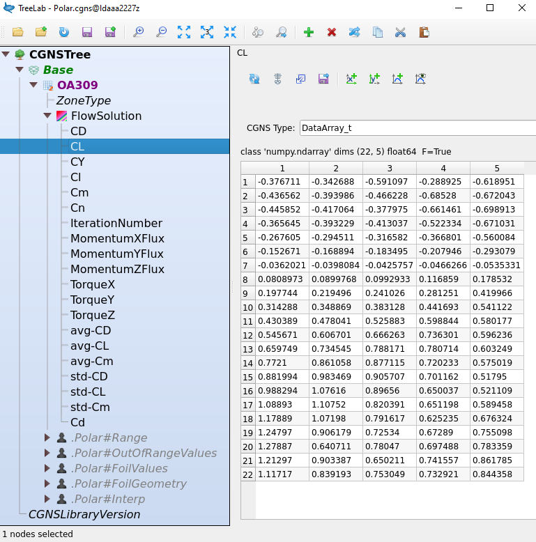
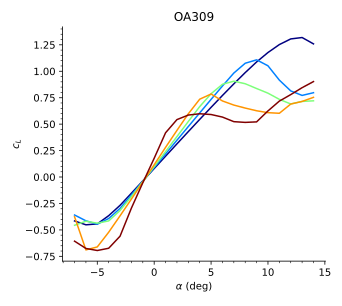

.. _AirfoilPolars:

Airfoil Polars
==============

.. _cgnsview: https://cgns.github.io/CGNS_docs_current/cgnstools/cgnsview/index.html

.. _matplotlib: https://matplotlib.org/

.. _XFoil: https://web.mit.edu/drela/Public/web/xfoil/

The purpose of this tutorial is to introduce the user to the *Workflow* allowing
for making CFD computations of the flow around an airfoil shape in order to
compute polars for varying :math:`(\alpha, Re_c, M)`. This tool employs
the functions implemented in module :mod:`MOLA.WorkflowAirfoil`.

All elements in this tutorial can be recovered in the example directory:

.. code-block:: bash

    /stck/lbernard/MOLA/v1.14/EXAMPLES/WORKFLOW_AIRFOIL/LIGHT_POLAR

The default template scripts can be found at:

.. code-block:: bash

    /stck/lbernard/MOLA/v1.14/TEMPLATES/WORKFLOW_AIRFOIL

Meshing procedure checking
--------------------------

Before launching the actual *Workflow* procedure, we will show how to make a
prior verification of the meshing procedure for a given user-provided airfoil
shape. This is an important step to make *before* any computation is launched.

Hence, in this section we will explain the different kinds of accepted input
file formats containing the airfoil coordinates, the meshing parameters
configuration and finally we will construct a sample mesh for verification.

.. tip:: at this stage, we recommend you to create an empty working directory
    where the files of the tutorial will be executed. For example:

    .. code-block:: bash

      mkdir /home/username/AIRFOILTEST
      cd /home/username/AIRFOILTEST

    or recover the entire aforementioned example directory.

Airfoil shape input requirements
********************************

It is important to note the requirements on the user-provided input format of
the airfoil contour.

There are essentially four kinds of allowed inputs for airfoils:

1. Cassiopee-Converter compatible curve
~~~~~~~~~~~~~~~~~~~~~~~~~~~~~~~~~~~~~~~

This kind of input is essentially any file format supported by Cassiopee's
:func:`Converter.PyTree.convertFile2PyTree` function. This includes, for example:

* ``*.cgns``

* ``*.plt``

* ``*.tp``

* ``*.v3d``

There is a number of important constraints to consider for the provided airfoil
shape, as illustrated in :numref:`AirfoilOrdering` :

#.
  Airfoil must be **a curve** supported on :math:`OXY` plane, with leading edge located
  at :math:`\min(x)` , typically located at coordinate :math:`(0,0)`; and trailing
  edge located at :math:`\max(x)` , typically located at coordinate :math:`(1,0)`

#.
  Airfoil shape must yield a **chord length** of 1 meter

#.
  Airfoil coordinates must be oriented **clockwise**, monotonically (without
  discontinuities)

#.
  First coordinate of the airfoil must be the **trailing edge** of the bottom
  side and last coordinate of the airfoil must be **trailing edge** of the top
  side

.. _AirfoilOrdering:

    Requirements on the airfoil's points ordering and location

2. Selig airfoil coordinate format
~~~~~~~~~~~~~~~~~~~~~~~~~~~~~~~~~~

The `Selig format <http://airfoiltools.com/airfoil/index>`_ is accepted as
input file with extension ``*.dat`` or ``*.txt``. Most airfoils available through
the site `Airfoil Tools <http://airfoiltools.com/>`_ are available in Selig format.

Follow `this link <http://airfoiltools.com/airfoil/seligdatfile?airfoil=dae11-il>`_
to see an example of a Selig formatted text file (e.g. ``dae11.dat``).

3. Lednicer airfoil coordinate format
~~~~~~~~~~~~~~~~~~~~~~~~~~~~~~~~~~~~~

Another commonly used supported format is the `Lednicer format <http://airfoiltools.com/airfoil/index>`_ ,
which is accepted as input file with extension ``*.dat`` or ``*.txt``.
Most airfoils available through the site `Airfoil Tools <http://airfoiltools.com/>`_
are available in Lednicer format.

`Click-here <http://airfoiltools.com/airfoil/lednicerdatfile?airfoil=dae11-il>`_
to see an example of a Lednicer formatted text file.

4. NACA airfoil of 4- or 5-digit
~~~~~~~~~~~~~~~~~~~~~~~~~~~~~~~~

The last supported input is simply a 4- or 5-digit NACA airfoil generated by
equations. In this case, the input text file must exactly have the following
nomenclature:

.. code-block:: text

     NACAXXXX

Where ``XXXX`` must be replaced with the 4 or 5 digit identifier of the NACA
airfoil.

.. note:: Please note that the ``NACAXXXX`` text file can be empty

.. hint:: In UNIX systems, you can make use of the ``touch`` command to
    simply create a file. For example, the generation of a **NACA 0012** airfoil
    can be triggered like this:

    .. code-block:: bash

         touch NACA0012

    and this empty file with proper name will be used to generate the NACA 0012
    airfoil coordinates.

Meshing Parameters input file
*****************************

In this *Workflow* the mesh generation is done automatically. This does not mean
that the user has no control on the resulting mesh. On the contrary,
automatic mesh generation is associated with a set of mesh generation *parameters*
that determines the final mesh quality. This set of meshing parameters
are grouped in a file named ``MeshingParameters.py``. This set of parameters
are passed to :func:`MOLA.WorkflowAirfoil.buildMesh` function.

An example of a :download:`MeshingParameters.py <../../EXAMPLES/WORKFLOW_AIRFOIL/LIGHT_POLAR/MeshingParameters.py>`
file is given here:

.. literalinclude:: ../../EXAMPLES/WORKFLOW_AIRFOIL/LIGHT_POLAR/MeshingParameters.py
    :language: python

.. important:: the presented ``MeshingParameters.py`` example file produces a *light*
    mesh. Please feel free to adapt it according to the meshing requirements of
    your work. An example of a finer MeshingParameters file can be found in
    ``TEMPLATES/WORKFLOW_AIRFOIL`` directory. To know more about the parameters 
    of this function, please see the documentation of functions
    :py:func:`~MOLA.GenerativeShapeDesign.buildMesh` and
    :py:func:`~MOLA.GenerativeShapeDesign.extrudeAirfoil2D`

.. note:: some of *(or all)* the meshing parameters defined in dictionaries **Sizes**, **Cells**,
    **Points** and **options** can be undefined. In this case, undefined values
    are replaced by **default values** of :func:`~MOLA.WorkflowAirfoil.buildMesh`
    function. For using *all default* parameters, simple make a ``MeshingParameters.py``
    such like this:

    .. code-block:: python

        meshParams = {
            'References':{'DeltaYPlus':0.5},
            'Sizes':{}, 'Cells':{}, 'Points':{}, 'options':{},
                      }

Let us now make our first verification mesh. For this purpose, we use the
:download:`test-mesher.py <../../EXAMPLES/WORKFLOW_AIRFOIL/LIGHT_POLAR/test-mesher.py>`
script on the airfoil contained in ``OA309.cgns`` file:

.. literalinclude:: ../../EXAMPLES/WORKFLOW_AIRFOIL/LIGHT_POLAR/test-mesher.py

The execution of :download:`test-mesher.py <../../EXAMPLES/WORKFLOW_AIRFOIL/LIGHT_POLAR/test-mesher.py>`
produces a ``mesh.cgns`` file that looks like this:

Users shall make visual verification of the general quality of the produced
mesh *before launching* CFD simulations. Users shall verify that no negative
cells are produced, that transitions are smooth, etc. If required, users shall
fine-tune the parameters contained in file :download:`MeshingParameters_DENSE.py <../../TEMPLATES/WORKFLOW_AIRFOIL/MeshingParameters_DENSE.py>`
for achieving an acceptable quality of the mesh.

Configure and launch computations
---------------------------------

In this section we will show how to configure and launch the CFD simulations.
For this purpose, we can use the script
:download:`PolarLauncherStruct_BASIC.py <../../EXAMPLES/WORKFLOW_AIRFOIL/LIGHT_POLAR/PolarLauncherStruct_BASIC.py>`.

.. literalinclude:: ../../EXAMPLES/WORKFLOW_AIRFOIL/LIGHT_POLAR/PolarLauncherStruct_BASIC.py

As shown, this script essentially calls the function :func:`~MOLA.WorkflowAirfoil.launchBasicStructuredPolars`.
Users can refer to the function's documentation for detailed information. In this
tutorial we will only explain the basic minimal required inputs.

The variable **AER** is a :class:`str` standing for the AER code associated to a project and required
for launching jobs to SATOR.

The variable **FILE_GEOMETRY** is a :class:`str` indicating the relative or absolute
path of the file where the airfoil shape input information is contained.

.. attention:: **FILE_GEOMETRY** must be a path with readable rights.

Variable **PREFIX_JOB** is a :class:`str` used to label and identify uniquely
the CFD simulation cases of a given polar set. If user launches several
polars simultaneously (e.g. for :math:`Re_c /M` conditions or different airfoil
shapes) then **PREFIX_JOB** must be different for each polar set.

Variable **DIRECTORY_WORK** establishes the SATOR location where the polar cases
will be launched. If the indicated directory does not exist, then it will be
automatically created.

.. note:: it is not allowed to launch multiple polars at the same **DIRECTORY_WORK**.
  You must specify unique non-existing directories for each polar launch.

The next variables are the range of angle-of-attack, :math:`\alpha`, the range
of considered Mach number, :math:`M`, and the constant value of the ratio
:math:`Re_c / M`, which is employed for determining the actual :math:`Re_c` employed
at each requested Mach number.

Indeed, :func:`~MOLA.WorkflowAirfoil.launchBasicStructuredPolars` function is
specially designed for verifying the typical approximations used for generating
polars of rotors (or propellers) blade sections. Such approximations allows for
construction of 2D matrices of airfoil characteristics, instead of the 3D matrices
that would be required for proper characterization of the aerodynamic properties
of an airfoil.

This means that the airfoil characteristics (e.g. :math:`c_L`) that physically
depends on the three dimensionless numbers :math:`c_L(\alpha,M,R_c)` are
reduced to only two parameters by fixing a relationship between the Mach and
the Reynolds number :math:`c_L(\alpha,M; R_c(R_c/M = cte))`.

The linear relationship between Mach and Reynolds number is an excellent
approximation for a given operating conditions of a constant-chord blade, since
both Mach number and Reynolds increase linearly from root to tip.

However, this is not a very good assumption for blades with strong chord variations
and, in all cases, for polars to be employed at very different operating conditions.

For this reason, we recommend the use of different polar sets for strong variations
on the operating conditions of the blade.

.. tip:: For determining the correct ranges of :math:`M` and the associated value
    of :math:`Re_c/M`, users may want to have a look to :func:`MOLA.PropellerAnalysis.plotOperatingRanges`

.. hint:: Some default physical or numerical parameters can be easily modified
    by the user.

    For example, default turbulence model is Wilcox 2006 :math:`k-\omega`
    model. If user wants to employ a different turbulence model, then the
    input argument **ExtraElsAParams** of :func:`~MOLA.WorkflowAirfoil.launchBasicStructuredPolars`
    shall be adapted accordingly. Let us suppose that user wants to make a
    computation using Spalart-Allmaras model. Then, the function call would be
    like this:

    ::

        WF.launchBasicStructuredPolars(PREFIX_JOB, FILE_GEOMETRY, AER, 'sator',
                         DIRECTORY_WORK, AoARange, MachRange, ReynoldsOverMach,
                         ExtraElsAParams=dict(TurbulenceModel='SA'))

    Please refer to the documentation of all optional parameters of function :func:`~MOLA.WorkflowAirfoil.launchBasicStructuredPolars`
    in order to understand all the available options proposed to the user.
    These options shall cover a significant range of possibilities (numerical
    scheme, turbulence model, transition modeling, imposed transition modeling,
    custom statistics computation or convergence criteria...).

After adaptation of :download:`PolarLauncherStruct_BASIC.py <../../EXAMPLES/WORKFLOW_AIRFOIL/LIGHT_POLAR/PolarLauncherStruct_BASIC.py>`
script, the user can launch it and relevant data and jobs will be submitted to
SATOR. Hence, the next step of the *Workflow* consists in monitoring the evolution
of the computations.

Monitor the computations
------------------------

The execution of :download:`PolarLauncherStruct_BASIC.py <../../EXAMPLES/WORKFLOW_AIRFOIL/LIGHT_POLAR/PolarLauncherStruct_BASIC.py>`
will create a short SATOR job dedicated to building the meshes and creating the
computation directories. After this step is performed (this usually takes few
minutes), the computation jobs are launched. There is one job per pair of
:math:`(M, Re_c)` number.

.. tip:: check your jobs queue in sator easily from any machine using command:

    .. code-block:: bash

        mola_jobsqueue_sator

Check the simulation status and repatriate relevant files
*********************************************************

Next step consists in monitoring the evolution of the simulation. For this
purpose, we use the script :download:`PolarMonitor.py <../../EXAMPLES/WORKFLOW_AIRFOIL/LIGHT_POLAR/PolarMonitor.py>`

.. literalinclude:: ../../EXAMPLES/WORKFLOW_AIRFOIL/LIGHT_POLAR/PolarMonitor.py

In this script, several operations are performed. First, a call of function
:func:`~MOLA.WorkflowAirfoil.printConfigurationStatus` is performed. This
function allows for checking the running status of the simulation through a
simple terminal standard output. An example of such output is given next:

.. code-block:: text

    JobName |     a0           a22          a44          a66          a88
   Reynolds |   450000       750000       900000      1.05e+06      1.2e+06
       Mach |     0.3          0.5          0.6          0.7          0.8
        AoA |_____________________________________________________________________
         -7 |     OK           OK           OK           OK           OK
         -6 |     OK           OK           OK           OK           OK
         -5 |     OK           OK           OK           OK           OK
         -4 |     OK           OK           OK           OK           OK
         -3 |     OK           OK           OK           OK           OK
         -2 |     OK           OK           OK           OK           OK
         -1 |     OK           OK           OK           OK           OK
          0 |     OK           OK           OK           OK           OK
          1 |     OK           OK           OK           OK           OK
          2 |     OK           OK           OK           OK           OK
          3 |     OK           OK           OK           OK           OK
          4 |     OK           OK           OK           OK           OK
          5 |     OK           OK           OK           OK           OK
          6 |     OK           OK           OK           OK           OK
          7 |     OK           OK           OK           OK           OK
          8 |     OK           OK           OK           OK           OK
          9 |     OK           OK           OK           OK           OK
         10 |     OK           OK           OK           OK           OK
         11 |     OK           OK           OK           OK           OK
         12 |     OK           OK           OK           OK           OK
         13 |     OK           OK           OK           OK           OK
         14 |     OK           OK           OK           OK           OK

This output message shows the table of CFD runs as a 2D matrix. Rows show
constant angle of attack, :math:`\alpha`, and columns show constant pair
of Mach and Reynolds number, :math:`(M, Re_c)`. Each label (``PD``, ``GO``,
``OK``, ``KO`` or ``TO``) corresponds to a given status, as explained in
:func:`~MOLA.WorkflowAirfoil.printConfigurationStatus` documentation.

.. note:: If a run case crashes, then a *fail-safe mode* is used with very robust
    numerical parameters. To learn more about fail-safe mode employed, see ``FailSafeMode``
    :py:class:`dict` of file :download:`preprocess.py <../../TEMPLATES/WORKFLOW_AIRFOIL/preprocess.py>`.
    However, this does not offer any guarantee that the fail-safe mode computation
    can be run. If fail-safe mode provokes an elsA crash, status ``KO`` is shown.

.. important:: a status of ``OK`` does **NOT** mean that the case has converged !

The next part of :download:`PolarMonitor.py <../../EXAMPLES/WORKFLOW_AIRFOIL/LIGHT_POLAR/PolarMonitor.py>`
script is employed for repatriating relevant files of a single CFD case (for given
:math:`(\alpha, M)` and hence :math:`Re_c`). For this purpose, the variables

::

    AoA = 4.0
    Mach = 0.5

are used to select the case to monitor. In this example, the case :math:`\alpha=4^\circ`
at :math:`M=0.5` is chosen.

The following set of function calls are used to repatriate relevant files of the
simulation:

* ``JobsConfiguration.py``
    Summarizing all specific settings of **all** polar CFD runs

* ``setup.py``
    Containing specific physical and numerical parameters of the requested CFD
    case

* ``arrays.cgns``
    Contains 1D information about the requested case (aero
    coefficients, statistics, usage of memory...) as a function of the iteration
    number

* ``surfaces.cgns``
    Contains 2D wall quantities, including boundary-layer characteristic
    thicknesses, skin-friction, pressure, etc.

* ``fields.cgns``
    Includes the 3D flow fields.

    .. important:: the repatriated file ``fields.cgns`` of a **running**
         simulation corresponds to the fields at initialization. If the simulation
         has **terminated**, then this fields correspond to the last iteration of
         the run.

.. todo:: in future versions of the workflow, the monitor calls of a running
    simulation will force the saving of 1D, 2D and 3D data at current iteration
    and will repatriate this information automatically. Currently, only the
    last saved files are repatriated (users can modify the frequency at which
    ``arrays.cgns`` and ``surfaces.cgns`` are updated)

The last line of the script performs a fast comparison of pressure distribution
:math:`C_p` with respect to a `XFoil`_ computation, using :func:`~MOLA.WorkflowAirfoil.compareAgainstXFoil`.
User can set comparison variable to :math:`c_f`. Note that this call produces a
graphic output, which shall be anticipated if the script is called from remote
machines [#f1]_ . An example of the figure produced by this comparison is given:

.. image:: FIGURES/CpComparisonCFDXFoil.svg
    :width: 100%

Monitor the simulation convergence
**********************************

Now that relevant files are repatriated, it is possible to visualize the
integral loads evolution, using file ``arrays.cgns``.

The structure and contents of ``arrays.cgns`` can be explored using **treelab**
tool, as shown in :numref:`ArraysCGNSview`.

.. _ArraysCGNSview:

.. figure:: FIGURES/ArraysCGNSview.png
    :width: 50%
    :align: center

    an example of data browsing of ``arrays.cgns`` file

For plotting the data contained in ``arrays.cgns``, we strongly recommend the
use of `matplotlib`_ .

The example script :download:`monitor_loads.py <../../TEMPLATES/WORKFLOW_AIRFOIL/monitor_loads.py>`
allows for plotting a flux variable:

.. literalinclude:: ../../TEMPLATES/WORKFLOW_AIRFOIL/monitor_loads.py

which produces the following plot:

Monitor the wall distributions
******************************

Any wall field contained in ``surfaces.cgns`` file can be plotted.
The script :download:`monitor_airfoil_distributions.py <../../TEMPLATES/WORKFLOW_AIRFOIL/monitor_airfoil_distributions.py>`
can be used as template for making such plots:

.. literalinclude:: ../../TEMPLATES/WORKFLOW_AIRFOIL/monitor_airfoil_distributions.py

which produces the following plot:

.. seealso:: the aforementioned script :download:`monitor_airfoil_distributions.py <../../TEMPLATES/WORKFLOW_AIRFOIL/monitor_airfoil_distributions.py>`
    is just an example of how the user can plot the variables contained in
    ``surfaces.cgns`` file (plus those added in post-process by :func:`~MOLA.WorkflowAirfoil.addRelevantWallFieldsFromElsAFieldsAtVertex`).
    There exist many post-processing and visualization possibilities depending
    on the user's objectives.

    Users may be interested in consulting the documentation of the following
    functions:

    * :func:`MOLA.WorkflowAirfoil.addRelevantWallFieldsFromElsAFieldsAtVertex`

    * :func:`MOLA.WorkflowAirfoil.mergeWallsAndSplitAirfoilSides`

    * :func:`MOLA.WorkflowAirfoil.computeTransitionCriterion`

    * :func:`MOLA.Postprocess.postProcessWallsFromElsaExtraction`

    * :func:`MOLA.InternalShortcuts.getxyz`

    * :func:`MOLA.InternalShortcuts.getVars`

    * :func:`MOLA.InternalShortcuts.get`

.. important:: **REMEMBER** to make sure that **before** execution of
    :download:`monitor_loads.py <../../TEMPLATES/WORKFLOW_AIRFOIL/monitor_loads.py>`
    and/or
    :download:`monitor_airfoil_distributions.py <../../TEMPLATES/WORKFLOW_AIRFOIL/monitor_airfoil_distributions.py>`
    scripts, you must have repatriated the relevant files using
    :download:`PolarMonitor.py <../../EXAMPLES/WORKFLOW_AIRFOIL/LIGHT_POLAR/PolarMonitor.py>`
    which must include the correct values of **DIRECTORY_WORK**, **AoA** and **Mach**
    variables.

    Hence, the correct procedure is:

    #. execution of :download:`PolarMonitor.py <../../EXAMPLES/WORKFLOW_AIRFOIL/LIGHT_POLAR/PolarMonitor.py>`

    #. execution of :download:`monitor_loads.py <../../TEMPLATES/WORKFLOW_AIRFOIL/monitor_loads.py>`

    #. and/or execution of :download:`monitor_airfoil_distributions.py <../../TEMPLATES/WORKFLOW_AIRFOIL/monitor_airfoil_distributions.py>`

Visualize the flow fields
*************************

Once a CFD case has terminated, the user can visualize its flow fields using
Cassiopee CPlot library.

For this purpose, select the case to be visualized in :download:`PolarMonitor.py <../../EXAMPLES/WORKFLOW_AIRFOIL/LIGHT_POLAR/PolarMonitor.py>`
script and launch the script. The function :py:func:`~MOLA.WorkflowAirfoil.getCaseFields`
will repatriate the file ``fields.cgns`` to your local directory in order to be
visualized.

Then, you can open this file using cassiopee graphical user interface as follows:

.. code-block:: bash

    cassiopee fields.cgns

.. note:: if you are launching cassiopee graphic interface from a remote machine
    allowing graphic output (e.g. *visio*), you may need to make a call to
    ``vglrun`` as follows:

    .. code-block:: bash

        vglrun cassiopee fields.cgns

then, you can explore the data contained in ``fields.cgns``, as shown in :numref:`AirfoilFields` :

.. _AirfoilFields:

    an example of visualization of flow fields contained ``fields.cgns`` file
    using Cassiopee GUI

Assemble the polar results
--------------------------

Once the computations have finished (check the computation status using :download:`PolarMonitor.py <../../EXAMPLES/WORKFLOW_AIRFOIL/LIGHT_POLAR/PolarMonitor.py>`)
the next step in the *workflow* consists in assembling all relevant data.
The data to be assembled is essentially the integral loads (contained in
``arrays.cgns`` file, where the aerodynamic coefficients are found) and the
wall distributions (contained in ``surfaces.cgns``, where pressure, friction and
boundary-layer quantities are found).

For this purpose, we use the script :download:`PolarBuilder.py <../../EXAMPLES/WORKFLOW_AIRFOIL/LIGHT_POLAR/PolarBuilder.py>`

.. literalinclude:: ../../EXAMPLES/WORKFLOW_AIRFOIL/LIGHT_POLAR/PolarBuilder.py

This script will loop all over the CFD cases, sequentially repatriating required
data and will assemble the information in a CGNS file, here named ``Polar.cgns``.

.. note:: the execution of :download:`PolarBuilder.py <../../EXAMPLES/WORKFLOW_AIRFOIL/LIGHT_POLAR/PolarBuilder.py>`
    script may take several minutes, depending on the number of computations
    that constitutes the polar matrix.

Once the script have finished, the file ``Polar.cgns`` is written and can
be explored using **treelab** tool, as shown in :numref:`PolarTree`.

.. _PolarTree:

    an example of data browsing of ``Polar.cgns`` file

Plot the polar results
----------------------

After generation of the file ``Polars.cgns``, the data contained in the file
can easily be plotted.

In order to facilitate the plotting, an automatic plotting function based
on `matplotlib`_ is proposed, namely :func:`MOLA.LiftingLine.plotStructPyZonePolars`.

This allows for plotting of any quantity contained in the node ``FlowSolution``
of each zone of ``Polars.cgns``.

The call is simply (:download:`PolarPlotter.py <../../TEMPLATES/WORKFLOW_AIRFOIL/PolarPlotter.py>`)

.. literalinclude:: ../../TEMPLATES/WORKFLOW_AIRFOIL/PolarPlotter.py

A series of ``*.svg`` files are produced including the airfoil curves of the
polars, and the curves legend.

.. hint:: if you wish to write the figure in a different file format (like
  ``pdf``, or ``png``), then have a look to :py:func:`~MOLA.LiftingLine.plotStructPyZonePolars`
  documentation in order to modify the appropriate parameter

Let us show the curve :math:`c_L(\alpha)` and
its legend (files ``PolarsCL_OA309_original.svg`` and ``PolarsLegend_OA309_original.svg``):

.. _CLa:

    :math:`c_L(\alpha)` of ``Polar.cgns`` file

At this stage, we can globally evaluate the convergence of all the simulations
in a glance, thanks to the plot of the standard deviation of :math:`c_L`. For
this, we inspect file ``Polarsstd-CL_OA309_original.svg``, shown in
:numref:`stdCL`.

.. _stdCL:

    Standard deviation of :math:`c_L` of ``Polar.cgns`` file

Indeed, :numref:`stdCL` shows that several runs produced high levels of
standard deviation of :math:`c_L`. This explains the *wavy* shape of some of
the curves of :numref:`CLa`, specially in the stalled regime.

Instead of keeping these poorly converged results in the assembled ``Polars.cgns`` data,
the user may want to ignore these by forcing a interpolation of empirical high
angles of attack stalled values. This strategy may improve a bit the numerical
robustness and reliability near the stall conditions of Lifting-Line based codes
employing the polar data generated using this workflow. For this reason, a
correction procedure is proposed in the next section.

Correction of polar results
---------------------------

As explained in the previous section, :numref:`stdCL` shows that some computations
may not have converged sufficiently, so that the user may prefer to replace
these values with stalled big angle of attack interpolated values. The purpose
of this section is to show the available procedure for performing this task.

The proposed function for performing this task is :func:`~MOLA.WorkflowAirfoil.correctPolar`
which is easily called (:download:`PolarCorrector.py <../../EXAMPLES/WORKFLOW_AIRFOIL/LIGHT_POLAR/PolarCorrector.py>`):

.. literalinclude:: ../../EXAMPLES/WORKFLOW_AIRFOIL/LIGHT_POLAR/PolarCorrector.py

This will produce a new polar file (``PolarCorrected.cgns``) with interpolated
aero coefficients of CFD cases that yield a standard deviation of :math:`std(c_L) > 5\mathrm{e}{-4}`.

Indeed, let us see how looks the new :math:`c_L(\alpha)` curve. For this,
we call again :download:`PolarPlotter.py <../../EXAMPLES/WORKFLOW_AIRFOIL/LIGHT_POLAR/PolarPlotter.py>`
but we adapt the input file and the tag suffix of the figures:

.. literalinclude:: ../../EXAMPLES/WORKFLOW_AIRFOIL/LIGHT_POLAR/PolarPlotter.py

and we visualize the file ``PolarsCL_OA309_corrected.svg``.

where we can see that the *wavy* behavior has been replaced with interpolated
values of empirical stalled conditions.

.. important:: the amount of cases that are replaced is controlled by
    the threshold parameter **useBigRangeValuesIf_StdCLisHigherThan** of
    function :func:`~MOLA.WorkflowAirfoil.correctPolar`.

Workflow Checklist
------------------

#. connect to a machine with access to MOLA enabling graphic output

#. source MOLA environment and create a local working directory

#. retrieve suitable airfoil geometry file that is going to be used for computation

#. retrieve all necessary scripts from ``TEMPLATES/WORKFLOW_AIRFOIL``

#. adapt ``MeshingParameters.py`` to your needs

#. make a test mesh verification with :download:`test-mesher.py <../../TEMPLATES/WORKFLOW_AIRFOIL/test-mesher.py>`

#. adapt and launch CFD runs using :download:`PolarLauncherStruct_BASIC.py <../../TEMPLATES/WORKFLOW_AIRFOIL/PolarLauncherStruct_BASIC.py>`

#. monitor all the polars status and retrieve specific case files using :download:`PolarMonitor.py <../../TEMPLATES/WORKFLOW_AIRFOIL/PolarMonitor.py>`

#. inspect the specific case convergence using :download:`monitor_loads.py <../../TEMPLATES/WORKFLOW_AIRFOIL/monitor_loads.py>`

#. inspect the specific case airfoil distributions using :download:`monitor_airfoil_distributions.py <../../TEMPLATES/WORKFLOW_AIRFOIL/monitor_airfoil_distributions.py>`

#. assemble the polar results data using :download:`PolarBuilder.py <../../TEMPLATES/WORKFLOW_AIRFOIL/PolarBuilder.py>`

#. plot polar results using :download:`PolarPlotter.py <../../TEMPLATES/WORKFLOW_AIRFOIL/PolarPlotter.py>`

#. *If required*, correct polar results using :download:`PolarCorrector.py <../../TEMPLATES/WORKFLOW_AIRFOIL/PolarCorrector.py>`

#. *If required*, plot the corrected polar using again :download:`PolarPlotter.py <../../TEMPLATES/WORKFLOW_AIRFOIL/PolarPlotter.py>`

Conclusion
----------

In this tutorial we have shown how to generate polars of airfoils in a manner
that is specially suited for rotor and propeller computations using the concept
of Lifting-Line.

.. attention:: the suitability of this workflow to other applications or usages
    beyond the scope of its design purposes is not guaranteed.

Users willing to modify default parameters in order to make an advanced use of
this workflow (such as turbulence modeling or computed/imposed transitional
modeling or other specific physical or numerical settings) are invited to consult
the optional parameters of function :func:`MOLA.WorkflowAirfoil.launchBasicStructuredPolars`
in order to verify if it can meet its requirements.

Moreover, advanced users may be interested in re-implementing :func:`MOLA.WorkflowAirfoil.launchBasicStructuredPolars`
in order to suit their needs.

.. rubric:: Footnotes

.. [#f1] .. tip:: when using remote machines, allow for graphic output using the flag ``--x11`` when connecting through ``ssh``.
