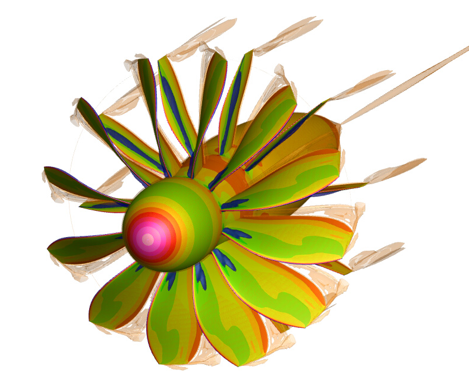

.. _Examples:

Examples
========

This page summarizes all examples that can be found on ``EXAMPLES`` directory.

BEMT
----

Design cartography of a rotor
*****************************

.. code-block:: bash

   /stck/lbernard/MOLA/v1.14/EXAMPLES/BEMT/ROTOR_DESIGN

**Short description:** computation of the geometrical laws of the blade
(and associated ``LiftingLine.cgns`` files)  using Minimum Induced Loss theory
based on Blade Element Momentum Theory (BEMT)

.. figure:: ../../EXAMPLES/BEMT/ROTOR_DESIGN/design.svg
    :width: 60%
    :align: center

    Figure of Merit enveloppe for constant Thrust, at various rotation speeds

MESHING
-------

Modification of an airfoil geometry
***********************************

.. code-block:: bash

   /stck/lbernard/MOLA/v1.14/EXAMPLES/MESHING/AIRFOIL_DESIGN/

**Short description:** modify an existing airfoil using new airfoil geometrical
characteristics

.. figure:: ../../EXAMPLES/MESHING/AIRFOIL_DESIGN/ModifyAirfoil.svg
    :width: 80%
    :align: center

    Comparison of original airfoil (gray) and modified (black), including their
    mean camber lines

Generation of a O-H mesh surface
********************************

.. code-block:: bash

   /stck/lbernard/MOLA/v1.14/EXAMPLES/MESHING/PERIODIC_O-H

**Short description:** create a O-H surface grid with arbitrary orientation

.. figure:: ../../EXAMPLES/MESHING/PERIODIC_O-H/mesh2D.gif
    :width: 80%
    :align: center

    OH grid around an airfoil, with imposed coplanar boundaries

.. figure:: ../../EXAMPLES/MESHING/PERIODIC_O-H/mesh3D.gif
    :width: 80%
    :align: center

    OH grid around an airfoil, with imposed 3D boundaries and projection onto
    a cylinder surface

WORKFLOW AIRFOIL
----------------

Very light single case
**********************

.. code-block:: bash

   /stck/lbernard/MOLA/v1.14/EXAMPLES/WORKFLOW_AIRFOIL/LIGHT_SINGLE_CASE

**Short description:** very light case of a 2D flow computation around an airfoil
showing the main steps of a MOLA computation using elsA, from mesh construction
up to simple post-processed ``OUTPUT`` files. This case is very light, as it can
run in a local machine.

.. figure:: ../../EXAMPLES/WORKFLOW_AIRFOIL/LIGHT_SINGLE_CASE/MachContour.png
    :width: 80%
    :align: center

    Contour of Mach number around NACA0012 airfoil

Airfoil Polar computation using light mesh
******************************************

.. code-block:: bash

   /stck/lbernard/MOLA/v1.14/EXAMPLES/WORKFLOW_AIRFOIL/LIGHT_POLAR

**Short description:** this example is employed in Tutorial :ref:`AirfoilPolars`.

.. figure:: FIGURES/PolarsCL_OA309_original.svg
    :width: 80%
    :align: center

    :math:`c_L(\alpha)` of around OA309 airfoil

WORKFLOW COMPRESSOR
-------------------

.. _Rotor37:

Rotor 37
********

.. code-block:: bash

    /stck/lbernard/MOLA/v1.14/EXAMPLES/WORKFLOW_COMPRESSOR/rotor37_SingleCase/

.. figure:: ../../EXAMPLES/WORKFLOW_COMPRESSOR/rotor37_SingleCase/OUTPUT/static_pressure.png
    :width: 80%
    :align: center

    Static pressure at 10%, 50% and 90% of blade height

**Short description**:

The NASA 37 transonic rotor is a well known turbomachinery open test case.
The rotor has 36 blades and a nominal speed of 17188.7 rpm.
This test case is interesting to evaluate the robustness of a CFD solver since
it presents a shock-wave/boundary-layer interaction leading to a flow separation.

At design point, the mass flow rate is 20.5114 kg/s, the stagnation pressure ratio is 2.106,
and the polytropic efficiency is 0.889.

For more information on the configuration and experimental data,
see:

 * Agard-AR-355 , "CFD Validation for Propulsion System Components", May 1998:
   https://apps.dtic.mil/sti/pdfs/ADA349027.pdf

The mesh is very light (around 500 000 cells), which allow quick tests on few CPU.

Rotor 37 - iso-speed line
*************************

.. code-block:: bash

    /stck/lbernard/MOLA/v1.14/EXAMPLES/WORKFLOW_COMPRESSOR/rotor37_IsoSpeedLine/

.. figure:: ../../EXAMPLES/WORKFLOW_COMPRESSOR/rotor37_IsoSpeedLine/isoSpeedLines.png
    :width: 80%
    :align: center

    Performance on the iso-speed line

**Short description**:

This case is identical to :ref:`Rotor37`, except that several operating points
are simulated for the design rotational speed, by varying the outflow condition.

LMFA linear cascade
*******************

.. code-block:: bash

    /stck/lbernard/MOLA/v1.14/EXAMPLES/WORKFLOW_COMPRESSOR/LMFAcascade_NACA65009/

.. figure:: ../../EXAMPLES/WORKFLOW_COMPRESSOR/LMFAcascade_NACA65009/OUTPUT/LMFAcascade.png
    :width: 80%
    :align: center

    Mach number under 4 degrees of incidence.

**Short description**:

This is a linear cascade of NACA 65-009 profiles, previously installed in
LMFA facilities.
The width of the domain is 0.134m, with a periodicity by translation.
The blade leading edge angle is 54.31 degrees and the flow incidence in the
example is 4 degrees.
The blade chord-based Reynolds number is :math:`3.8 \times 10^5`.

The mesh has around 1.7 million cells.

An experimental reference for this configuration is:

* Zambonini, G., Ottavy, X., and Kriegseis, J. (March 22, 2017). "Corner Separation Dynamics in a Linear Compressor Cascade." ASME. J. Fluids Eng. June 2017; 139(6): 061101. https://doi.org/10.1115/1.4035876

WORKFLOW AEROTHERMAL COUPLING
-----------------------------

Channel with two heated walls
*****************************

.. code-block:: bash

    /stck/lbernard/MOLA/v1.14/EXAMPLES/WORKFLOW_AEROTHERMAL_COUPLING/channel_2HeatedWalls_structured/

.. figure:: ../../EXAMPLES/WORKFLOW_AEROTHERMAL_COUPLING/channel_2HeatedWalls_structured/Temperature.png
    :width: 100%
    :align: center

    Temperature inside the flow and the solid (top and bottom walls)

**Short description**

This test case is a 2D (one cell in Z direction) flow channel with heated walls on both sides.
elsA is used for the fluid domain (structured mesh), and Zset is used for the solid domain.

Upstream the heated walls, walls are adiabatic and viscous.
For the heated walls, a constant temperature (1500K for the bottom wall, 1300K
for the top wall) is imposed for the boudary conditions of the solid domain
(other than interfaces with the fluid domain).
At the interfaces between the fluid and the solid domains, the coupling is done
with a Dirichlet condition on the fluid side and a Robin condition on the solid side.

Correspondance between elsA and Zset Families :

==========   =======
elsA         Zset
==========   =======
BottomWall   nord
TopWall      sud1
==========   =======

WORKFLOW STANDARD
-----------------

.. _LightWing:

Light wing case
***************

.. code-block:: bash

   /stck/lbernard/MOLA/v1.14/EXAMPLES/WORKFLOW_STANDARD/LIGHT_WING

**Short description:** light case of the 3D flow computation around a wing
showing the main steps of a MOLA computation using elsA, from mesh construction
up to simple post-processed ``OUTPUT`` files. This case is very light, as it can
run in a local machine. Thus, mesh is *VERY* coarse and must be refined for
practical usage. This case can be used for rapid testing of MOLA functionalities.

.. figure:: ../../EXAMPLES/WORKFLOW_STANDARD/LIGHT_WING/SurfacesContours.png
    :width: 80%
    :align: center

    Contour of Mach number around NACA0012 airfoil

Light wing case (overset)
*************************

.. code-block:: bash

   /stck/lbernard/MOLA/v1.14/EXAMPLES/WORKFLOW_STANDARD/LIGHT_OVERSET

**Short description:** This case is identical to :ref:`LightWing`, except that
a cartesian octree-type grid is employed around a bodyfitted mesh component around
the wing. This small example simply shows an overset type (a.k.a. chimera technique)
preprocessing. Mesh is *VERY* coarse and must be refined for practical usage.

.. figure:: ../../EXAMPLES/WORKFLOW_STANDARD/LIGHT_OVERSET/arrays.svg
    :width: 80%
    :align: center

    Evolution of :math:`C_L` and its statistics during the simulation

Light Propeller using Bodyforce
*******************************

.. code-block:: bash

   /stck/lbernard/MOLA/v1.14/EXAMPLES/WORKFLOW_STANDARD/LIGHT_BODYFORCE

**Short description:** Light case of the CFD computation of a propeller using
the Bodyforce Method. Mesh is *VERY* coarse and must be refined for practical
usage. Only an octree grid is employed, with no overset components.

.. figure:: ../../EXAMPLES/WORKFLOW_STANDARD/LIGHT_BODYFORCE/arrays.svg
    :width: 80%
    :align: center

    Evolution of propeller's Thrust and its statistics during the simulation

Aircraft components with several propellers and rotors
******************************************************

.. code-block:: bash

    /stck/lbernard/MOLA/v1.14/EXAMPLES/WORKFLOW_STANDARD/HEAVY_OVERSET_BODYFORCE

.. code-block:: bash

    /tmp_user/sator/lbernard/MOLA/v1.14/EXAMPLES/WORKFLOW_STANDARD/HEAVY_OVERSET_BODYFORCE

**Short description:** Simulation of an aircraft represented
by only two solids (wing and horizontal stabilizer) which includes a propulsive
propeller on the wing-tip and two rotors for hovering. Only half configuration is
simulated.

.. figure:: ../../EXAMPLES/WORKFLOW_STANDARD/HEAVY_OVERSET_BODYFORCE/FieldsWithProps.png
    :width: 80%
    :align: center

    View of two slices of *MomentumX* including the solid walls and bodyforce
    disks

WORKFLOW PROPELLER
------------------

HAD-1 Propeller
***************

.. code-block:: bash

    /stck/lbernard/MOLA/v1.14/EXAMPLES/WORKFLOW_PROPELLER/HAD-1

.. code-block:: bash

    /tmp_user/sator/lbernard/MOLA/v1.14/EXAMPLES/WORKFLOW_PROPELLER/HAD-1

**Short description:** Simulation of HAD-1 propeller in axial flight conditions.
This case features automatic full-match grid generation.
The input data for grid generation are the sections (airfoils) of the propeller
and the spinner profile curve.

Own designed propeller
**********************

.. code-block:: bash

    /stck/lbernard/MOLA/v1.14/EXAMPLES/WORKFLOW_PROPELLER/BLADE_NACA_AIRFOIL

.. code-block:: bash

    /tmp_user/sator/lbernard/MOLA/v1.14/EXAMPLES/WORKFLOW_PROPELLER/BLADE_NACA_AIRFOIL

**Short description:** Simulation of a totally custom propeller in axial flight
conditions.
The case features automatic full-match grid generation.
Blade geometry can be defined either by geometrical laws, an existing LiftingLine,
or by passing sections interpolation.
The spinner profile is automatically generated using geometrical parameters.

.. figure:: ../../EXAMPLES/WORKFLOW_PROPELLER/BLADE_NACA_AIRFOIL/blade_naca.png
    :width: 80%
    :align: center

    Propeller showing Q-criterion isosurfaces and Pressure contours

WORKFLOW ORAS
-------------

ORAS case
*********

Two equivalent examples are provided (one with imposing the mesh splitting at
preprocess, the other using automatic splitting during computation using pypart).

.. code-block:: bash

    /stck/lbernard/MOLA/v1.14/EXAMPLES/WORKFLOW_ORAS/ORAS_ProcImposed
    /stck/lbernard/MOLA/v1.14/EXAMPLES/WORKFLOW_ORAS/ORAS_PyPart

.. code-block:: bash

    /tmp_user/sator/lbernard/MOLA/v1.14/EXAMPLES/WORKFLOW_ORAS/ORAS_ProcImposed
    /tmp_user/sator/lbernard/MOLA/v1.14/EXAMPLES/WORKFLOW_ORAS/ORAS_PyPart

**Short description:** This example presents an Open Rotor and Stator (ORAS)
configuration for steady RANS computations with mixing-plane. The first lines of
the ``prepareMesh.py`` provide an example of what would be the recommended families
in the input mesh. The ``prepareMain.py`` file finalises the pre-processing for elsA.

.. warning::
  The mesh of this example is for ONERA internal use only. Diffusion of the mesh
  or the geometry is forbidden.

    Open rotor and stator (ORAS) simulation
