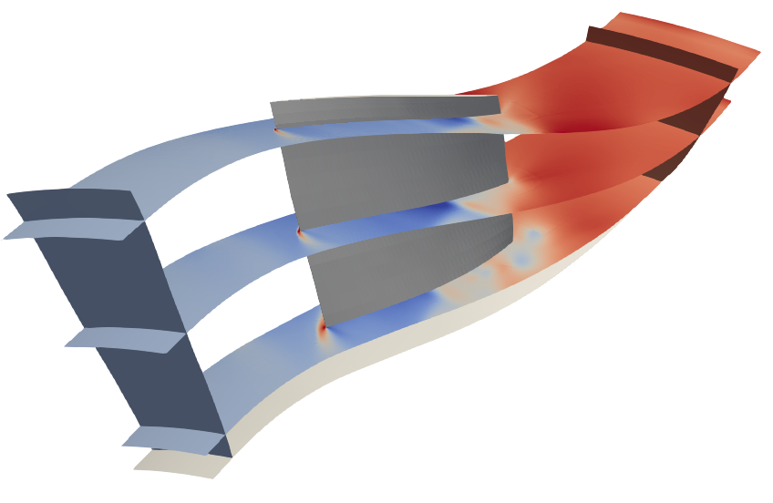

Workflow Compressor
===================

The purpose of this tutorial is to introduce the user to the *Workflow* allowing
for making CFD computations of the flow around one or several compressor rows. This tool employs
the functions implemented in module :mod:`MOLA.WorkflowCompressor`.

Firstly, take a look at the :ref:`Environment and machine`
section and check that you are able to source the environment correctly.

This tutorial follows the example case in
*EXAMPLES/WORKFLOW_COMPRESSOR/rotor37_SingleCase*.
It develops the preparation of the mesh, starting from a file generated with
Autogrid 5, the preparation of the simulation with elsA,
the monitoring of results, and how the simulation comes to an end.

You may also find a FAQ section at the end of the tutorial, to be able to go
beyond the simple case presented here.

.. warning::

    Using ETC module (imported in the Workflow Compressor) with Python 3, MPI errors could happen (for details, see
    the MOLA `issue #70 <https://gitlab.onera.net/numerics/mola/-/issues/70>`_).
    To solve this problem, you may simply replace your command:

    .. code-block::

        python3 my_script.py

    by

    .. code-block::

        mpirun -np 1 python3 my_script.py

Inputs are:

#. a mesh generated by Autogrid 5: ``rotor37.cgns``

#. the script :download:`prepareMainCGNS.py <../../EXAMPLES/WORKFLOW_COMPRESSOR/rotor37_SingleCase/prepareMainCGNS.py>`

1. Preparation of the mesh
--------------------------

The purpose of this section is to prepare the mesh that will be used for one or
several elsA simulations. The following operations will be done:

#. load and clean the mesh from Autogrid 5
#. apply transformations
#. add grid connectivities
#. duplicate the mesh in rotation (if needed)
#. split and distribute the mesh (only if PyPart is not used)
#. make final elsA-specific adaptations of CGNS data
#. add the height coordinate (0 at hub, 1 at shroud) at mesh nodes

Input mesh
**********

First of all, we need to check that our input mesh fills the following
requirements:

#. It has to have been generated by Autogrid 5 (tested on version 12.2 only).
   In particular, the engine axis is supposed to be the Z-axis, and the lengths
   are in meters.

#. Families corresponding to each row must be written in the CGNS file.

#. Boundary conditions must be written in the CGNS and associated with Families.
   That includes rotor/stator interfaces.

   .. important::
        Because wall boundary conditions will be automatically set latter, the
        names of associated families must be the following:

        * for the shroud: all family names must contain the pattern 'SHROUD' or 'CARTER'
          (in lower, upper or capitalized case)

        * for the hub: all family names must contain the pattern 'HUB' or 'MOYEU'
          (in lower, upper or capitalized case)

        * for the blades: all family names must contain the pattern 'BLADE' or 'AUBE'
          (in lower, upper or capitalized case).

   An example of such a mesh is given in the figure below:

   .. figure:: FIGURES_WORKFLOW_COMPRESSOR/inputMeshAG5_tree.png
      :width: 90%
      :align: center

      Example of input mesh tree

.. note::
    The mesh does not need to contain grid connectivities, but their presence
    is not a problem.

.. note::
    To have families (for boundary conditions and rotor/stator interfaces) in the
    CGNS file written by Autogrid, be sure to have checked the option
    "Save CGNS patch info / family name control" in the pannel "Saving" of Preferences.

    .. figure:: FIGURES_WORKFLOW_COMPRESSOR/AG5_preferences.png
       :width: 40%
       :align: center

       Recommended saving preferences in Autogrid5

Script prepareMainCGNS.py - first part
**************************************

There are two ways: the first to prepare the mesh to use PyPart latter (during the
elsA simulation), and the second to split and distribute the mesh before the
simulation. The two following paragraphs explain each way.

.. important::
    It is the only moment when we have to precise if we want to use PyPart or
    not. In the following, MOLA will automatically detect which choice has been
    made.

With PyPart
~~~~~~~~~~~

First, if it is not already done, let's download the script
:download:`prepareMainCGNS.py <../../EXAMPLES/WORKFLOW_COMPRESSOR/rotor37_SingleCase/prepareMainCGNS.py>`.
It contains the following first lines:

.. literalinclude:: ../../EXAMPLES/WORKFLOW_COMPRESSOR/rotor37_SingleCase/prepareMainCGNS.py
    :language: python
    :lines: -49

In this simple case, we just need to give the name  of the input mesh file
(here ``'rotor37.cgns'``). :mod:`~MOLA.WorkflowCompressor.prepareMesh4ElsA`
transforms the Autogrid mesh in a mesh readable by elsA.

The second function :mod:`~MOLA.WorkflowCompressor.parametrizeChannelHeight`
puts the variable ``ChannelHeight`` (0 at hub and 1 at shroud) in a node
``FlowSolution#Height`` in each zone. This new coordinate will stay in the tree
during all the simulation, allowing for example to make iso-surfaces in
co and post-preprocessing.

Without PyPart
~~~~~~~~~~~~~~

In this case, there is a additional constraint on the input mesh.
Each future globborder must be in contact with a unique block. The figure
below illustrates this requirement:

  Examples of not admitted and admitted meshes

This is required to be sure that the splitting will produce a matricial
blocking (needed for globborders).

Then, :mod:`~MOLA.WorkflowCompressor.prepareMesh4ElsA` must split and distribute
mesh blocks. To do that, the additional argument **splitOptions** has to be given.
There are two main ways to use it:

#. ``splitOptions=dict(mode='imposed', NumberOfProcessors=48)``: The mesh will be
   split and distributed on 48 processors.

#. ``splitOptions=dict(mode='auto')``: automatically search for the optimum
   distribution with the constraints of 48 processors per node (default value,
   for Cascade nodes **sator-new**). The number of nodes to use is an output (so
   not given by the user).

.. note: for more details, see the dedicated documentation of :mod:`~MOLA.WorkflowCompressor.prepareMesh4ElsA`

2. Configure and launch computation
-----------------------------------

The script :download:`prepareMainCGNS.py <../../EXAMPLES/WORKFLOW_COMPRESSOR/rotor37_SingleCase/prepareMainCGNS.py>`.
continues with the following lines:

.. literalinclude:: ../../EXAMPLES/WORKFLOW_COMPRESSOR/rotor37_SingleCase/prepareMainCGNS.py
    :language: python
    :lines: 50-

In a nutshell, we just need to define several dictionaries and lists with user-defined
parameters (them that differ from the default parameters of the workflow), and
finally call the function :mod:`~MOLA.WorkflowCompressor.prepareMainCGNS4ElsA`.
Dictionaries and lists with user-defined parameters are explained in details in comments in
:download:`prepareMainCGNS.py <../../EXAMPLES/WORKFLOW_COMPRESSOR/rotor37_SingleCase/prepareMainCGNS.py>`.
However, we can sum up their purpose here:

* **TurboConfiguration** (:py:class:`dict`): contains all the parameters specific to the geometry,
  rows names and rotation speeds, reference planes, etc.

  ➥ More information in :mod:`MOLA.WorkflowCompressor.getTurboConfiguration` documentation

* **ReferenceValues** (:py:class:`dict`): contains values used to compute the reference flow field,
  the upstream conditions, the turbulence model and the coprocessing options.

  ➥ More information in :mod:`MOLA.WorkflowCompressor.computeReferenceValues` documentation

* **NumericalParams** (:py:class:`dict`): contains the parameters that will be passed
  to elsA ``numerics`` object.

  ➥ More information in :mod:`MOLA.Preprocess.getElsAkeysNumerics` documentation

.. tip:: only the parameters that differ from the default values of this workflow
         need to be defined. Thus, this dictionnary may be empty.

* **BoundaryConditions** (:py:class:`list`): contains all the boundary conditions
  to impose, except them on the wall (these ones are defined automatically).

  ➥ More information in :mod:`MOLA.WorkflowCompressor.setBoundaryConditions` documentation

* **Initialization** (:py:class:`dict`): contains parameters to initialize the
  flow field. There should be at least the key **method**. If **Initialization**
  is not given to :mod:`~MOLA.WorkflowCompressor.prepareMainCGNS4ElsA`, the flow
  is initialized uniformly using **ReferenceValues** (corresponds to **method**
  = ``'uniform'``).

  ➥ More information in :mod:`MOLA.Preprocess.initializeFlowSolution` documentation

* **Extractions** (:py:class:`list`): contains all the 2D extractions to
  do in coprocessing. Each extraction is defined as a :py:class:`dict` with a minimalist
  number of keys.

  ➥ More information in :mod:`MOLA.Coprocess.extractSurfaces` documentation

* **JobInformation** (:py:class:`dict`): contains the job name, the AER number
  and the number of processors.

At the end, :mod:`~MOLA.WorkflowCompressor.prepareMainCGNS4ElsA` creates the following
files:

* ``main.cgns``: it is the CGNS file that will be called by elsA.

* ``OUTPUT/fields.cgns``: it contains the initial flow field. ``main.cgns`` has
  links to the ``FlowSolution#Init`` nodes in this file. This file will be
  updated at the end of the simulation, to be able to run it again directly if
  needed.

* ``setup.py``: an ultra-light file containing all relevant information of the
  simulation. It must be consistant with ``main.cgns``. We can find all the
  input data given to :mod:`~MOLA.WorkflowCompressor.prepareMainCGNS4ElsA`,
  completed with default parameters and values computed from input data.

* :download:`compute.py <../../TEMPLATES/WORKFLOW_COMPRESSOR/compute.py>`: this
  is the Python script launching elsA. Because it reads information in
  ``setup.py``, we do not need to modify it for a standard application.

* :download:`coprocess.py <../../TEMPLATES/WORKFLOW_COMPRESSOR/coprocess.py>`:
  this is the Python script for co-processing. It performs extractions (with
  triggers) during the simulation and monitor convergence criteria. We do not
  need to modify it, but we could to make specific operations. For example,
  we could add our own function to post-process an extracted surface before
  saving it.

* :download:`job_template.sh <../../TEMPLATES/job_template.sh>`:
  This is the submission script. If not already given in the :py:class:`dict`
  **JobInformation**, we need to change the job name, the AER number
  and the number of processors. You do not need to make any other changes, it
  will automatically source the right environment depending on the machine.
  You may rename this file if you want.

* :download:`monitor_perfos.py <../../TEMPLATES/WORKFLOW_COMPRESSOR/monitor_perfos.py>`:
  This is a script used for monitoring the convergence of the simulation. Its
  behavior is explained in the next section.

.. note::
    For some reason, if you want to use your own version of `compute.py`,
    `coprocess.py`, `job_template.sh` and `monitor_perfos.py` (which is not
    recommended, but could be useful for developpers for example), you can
    deactivate the copy of these files by passing the argument ``COPY_TEMPLATES=False``
    to the function :mod:`~MOLA.WorkflowCompressor.prepareMainCGNS4ElsA`.

.. note::
    **Submission on a distant machine**: If you want to copy all the templates
    and files generated by :mod:`~MOLA.WorkflowCompressor.prepareMainCGNS4ElsA`
    in an other directory, possibly on sator (`tmp_user/sator`), you have to add
    the parameter `DIRECTORY_WORK` in **JobInformation**.

    Furthermore, you may directly submit the job adding the argument
    `SubmitJob=True` to the function :mod:`~MOLA.WorkflowCompressor.prepareMainCGNS4ElsA`.
    In that case, just after the end of execution of your script `prepareMainCGNS.py`,
    you should see your job submitted.

Then, we can launch the simulation with:

::

    >>> sbatch job_template.sh

3. Check the results and monitor the simulation
-----------------------------------------------

During the simulation, the file ``coprocess.log`` is written progressively. It
contains only the iterations and the save of extrations. As a reminder,
extraction options are given by:

* the :py:class:`dict` **CoprocessOptions** in the :py:class:`dict`
  **ReferenceValues** (firstly defined in ``prepareMainCGNS.py``, then written
  in ``setup.py``)

* the :py:class:`list` **Extractions** (also firstly defined in
  ``prepareMainCGNS.py``, then written in ``setup.py``)

The corresponding files are saved in the directory ``OUTPUT``, where there is
only ``fields.cgns`` when the simulation starts. Extraction files are written
periodically according the values of ``UpdateFieldsFrequency``,
``UpdateSurfacesFrequency`` and ``UpdateArraysFrequency`` in the
:py:class:`dict` **CoprocessOptions**. We can also trigger a manual extraction
with the commands:

::

    >>> touch SAVE_FIELDS
    >>> touch SAVE_SURFACES
    >>> touch SAVE_ARRAYS

We can check that the signal is well written in the file ``coprocess.py``:

::

    [0]: iteration 40
    [0]: iteration 41
    [0]: Received signal SAVE_SURFACES
    [0]: iteration 42
    [0]: will save OUTPUT/surfaces.cgns ...
    [0]: ... saved OUTPUT/surfaces.cgns
    [0]: iteration 43
    [0]: iteration 44

3D extractions: ``fields.cgns``
*******************************

Because the file ``main.cgns`` contains links to ``fields.cgns``, this file
cannot be overwritten without risk during the simulation. Instead, the 3D flow
field is extracted in the file ``tmp-fields.cgns``. This file will be moved into
``fields.cgns`` at the end of the simulation.

2D extractions: ``surfaces.cgns``
*********************************

As explained before, there are a lot of available 2D extractions that can be
defined in the :py:class:`list` **Extractions** (written in ``setup.py``). Each
extracted surface is written in one base of the PyTree saved in
``surfaces.cgns``:

    Content of the file ``surfaces.cgns``

In the figure above, the base *Iso_CoordinateX_0.08* has been unwrapped. We see
that it contains:

* one zone (``R37_R37_downstream.P0.N0.2``, which has been renamed by PyPart).
  Because it has been got with Cassiopee :func:`Post.isoSurfMC` method, it is
  unstructured. It still has a node ``FamilyName`` = ``R37``.

* the ``Family_t`` node ``R37``. It has been added because of the presence of a
  zone tagged with this family. It contains the node ``.Solver#Motion`` with
  motion information about the family.

* the node ``ReferenceState``, identical to the one found in ``main.cgns``.

* a node ``.ExtractionInfo``, which is optional and have been created
  automatically with information in the :py:class:`list` **Extractions** in
  ``setup.py``. It contains the following nodes:

  * *type* = ``IsoSurface``: indicates the type of extraction.

  * *field* = ``CoordinateX``: indicates the variable used for the isosurface.

  * *value* = ``0.08``: indicates the value used for the isosurface.

  * *ReferenceRow* = ``R37``: indicates that this surface is in the domain of the
    row ``R37``.

  * *tag* = ``InletPlane``: indicates a specific attribute for the extracted surface.

  *type*, *field* and *value* have been automatically added during the extraction.
  It allows not to depend on the name of the base, and are enought to defined
  completely the surface. *ReferenceRow* and *tag* have been added automatically
  in the :py:class:`list` **Extractions** by function
  :mod:`~MOLA.WorkflowCompressor.prepareMainCGNS4ElsA`, because of the presence
  of keys **InletPlane** and **OutletPlane** in the :py:class:`dict`
  **TurboConfiguration**.

.. hint::
    Arbitrary information nodes can be added by the user by defining them in
    the :py:class:`list` **Extractions**.

    Visualization the file ``surfaces.cgns`` with Paraview

1D extractions: ``arrays.cgns``
*******************************

The file ``arrays.cgns`` may contains different kinds of data:

* memory usage (mainly for debug)

* performance of monitored rows. This extraction is triggered by adding the line:

    >>> CO.monitorTurboPerformance(surfs, arrays, RequestedStatistics)

  in ``coprocess.py`` after having extracted the surfaces.

  .. important::
    A row is monitored only if parameters **InletPlane** and **OutletPlane**
    are set for this row in the :py:class:`dict` **TurboConfiguration**.

  .. important::
    Notice that this kind of extraction is triggered by extraction of surfaces,
    so it is controlled by the parameter ``UpdateSurfacesFrequency`` and not by
    ``UpdateArraysFrequency``.

  **RequestedStatistics** is a list of the statistics to extract. It is an
  optional entry of the :py:class:`dict` **CoprocessOptions** in the
  :py:class:`dict` **ReferenceValues**.
  By default, it is defined as the following:

  .. code-block:: python

    RequestedStatistics = ['rsd-{}'.format(var) for var in ['MassFlowIn', 'MassFlowOut',
        'PressureStagnationRatio', 'TemperatureStagnationRatio', 'EfficiencyIsentropic',
        'PressureStagnationLossCoeff']]

  Available types of statistics are:

  * ``avg-X``: to compute the sliding average of variable ``X``.

  * ``std-X``: to compute the sliding standard deviation of variable ``X``.

  * ``rsd-X``: to compute the sliding relative standard deviation (=avg/std)
    of variable ``X``.

  Each of these prefixes can be chained (e.g. you may request ``std-std-MassFlowIn``),
  which can be useful to monitor unsteady simulations.

  .. note::
    For more details, see the documentation of :mod:`~MOLA.Coprocess.extractIntegralData`.

  Finally, notice that :mod:`~MOLA.Coprocess.monitorTurboPerformance` relies on
  the existence of the node ``.ExtractionInfo`` and its children ``ReferenceRow``
  and ``tag`` (= `InletPlane` or `OutletPlane`) to detect the rows to monitor.

Each data group is written in one base of the PyTree saved in ``arrays.cgns``:

    Content of the file ``arrays.cgns``

We can monitor the contains of ``arrays.cgns`` during the simulation with the
script :download:`monitor_perfos.py <../../TEMPLATES/WORKFLOW_COMPRESSOR/monitor_perfos.py>`.
Except if we want to change the display of figures, we can launch it as is in
the simulation folder:

.. code-block::

    >>> python monitor_perfo.py

.. note::
    This script was written to be generic. It should be applied without any
    change to any case run using MOLA. If not, please report this case and this
    script will be adapted in its next version.

It results in the creation of several figures:

* the first set of figures allows to monitor the performance of each row (one
  figure per row). Each figure is displayed and also saved as ``perfos_<ROW>.png``:

  .. figure:: FIGURES_WORKFLOW_COMPRESSOR/perfos_R37.png
      :width: 100%
      :align: center

      Performance of the row R37, read from the file ``arrays.cgns``. On the left,
      raw data and sliding average. On the right, relative standard deviation
      (= standard deviation divided by average).

* the figure ``massflow.png``, showing massflow rates through several planes:

  * the boundary conditions ``R37_INFLOW`` and ``R37_OUTFLOW`` are automatically
    included on this figure because they are recognised with their types
    ``BCInflow*`` and ``BCOutflow*``. Notice that for another case, rotor/stator
    inferfaces would also be integrated to the figure, because they are also
    identified as ``BCInflow*`` and ``BCOutflow*`` by MOLA preprocess.

  * the planes identified as ``PERFOS_R37_In`` and ``PERFOS_R37_Out``, corresponding
    to the *InletPlane* and *OutletPlane* for the row *R37*.

  .. figure:: FIGURES_WORKFLOW_COMPRESSOR/massflow.png
      :width: 60%
      :align: center

      Massflow

* the figure ``residuals.png`` (only when the simulation is over):

  .. figure:: FIGURES_WORKFLOW_COMPRESSOR/residuals.png
      :width: 60%
      :align: center

      Residuals

  .. note::
    This figure is generated only if the simulation is over. This mechanism
    should be improved in the future to be able to monitor residuals during the
    simulation.

.. hint::
    If we want to save one file for each iteration of extraction (for example for
    an unsteady simulation), we just need to add the argument
    ``tagWithIteration`` = :py:obj:`True` to :mod:`~MOLA.Coprocess.save` in
    ``coprocess.py``:

        >>> CO.save(arraysTree, os.path.join(DIRECTORY_OUTPUT,FILE_ARRAYS), tagWithIteration=True)

    This stands for 3D (``fields.cgns``), 2D (``surfaces.cgns``) and 1D
    (``arrays.cgns``) extractions, because the same function :mod:`~MOLA.Coprocess.save`
    is used in the three cases.

4. End of the simulation
------------------------

The simulation may end for several reasons:

#. the simulation has reached the maximimum iteration. This situtation should be
   avoided by setting a really high value (default is 30000).
   The empty file ``'COMPLETED'`` is created to tag the simulation directory.

#. the Time Out has been reached (set by default to 15h for sator). In that case,
   because there is a security margin, final extractions are done and the
   simulation is ended normally.
   The empty file ``'NEWJOB_REQUIRED'`` is created to tag the simulation directory.

#. The convergence criterion has been reached. It must have been programmed in
   the :py:class:`dict` **CoprocessOptions** in the :py:class:`dict`
   **ReferenceValues** (in ``setup.py``) and the dedicated lines must be in
   ``coprocess.py``:

   .. code-block:: python

       if SAVE_SURFACES:
            surfs = CO.extractSurfaces(toWithSkeleton, setup.Extractions)
            CO.save(surfs,os.path.join(DIRECTORY_OUTPUT,FILE_SURFACES))
            CO.monitorTurboPerformance(surfs, arrays, RequestedStatistics)

            if (it-inititer)>ItersMinEvenIfConverged and not CONVERGED:
               CONVERGED = CO.isConverged(ConvergenceCriteria)

   with **ConvergenceCriteria** defining the list of criteria to monitor. For
   more information, see the documentation of :mod:`MOLA.Coprocess.isConverged`.

   In this case, the end of the file ``LOGS/coprocess-1.log`` should be like this:

   .. code-block::

        [0]: iteration 1980
        [0]: iteration 1981
        [0]: will save OUTPUT/arrays.cgns ...
        [0]: ... saved OUTPUT/arrays.cgns
        [0]: will save OUTPUT/surfaces.cgns ...
        [0]: ... saved OUTPUT/surfaces.cgns
        [0]: will save OUTPUT/arrays.cgns ...
        [0]: ... saved OUTPUT/arrays.cgns
        [0]: *******************************************
        [0]: CONVERGED at iteration 1980 since:
          rsd-MassFlowIn < 0.001 on PERFOS_R37 (Necessary)
          rsd-PressureStagnationRatio < 0.001 on PERFOS_R37 (Necessary)
        [0]: *******************************************
        [0]: TERMINATING COMPUTATION
        [0]: updating setup.py ...
        [0]: updating setup.py ... OK
        [0]: will save OUTPUT/arrays.cgns ...
        [0]: ... saved OUTPUT/arrays.cgns
        [0]: will save OUTPUT/arrays.cgns ...
        [0]: ... saved OUTPUT/arrays.cgns
        [0]: will save OUTPUT/surfaces.cgns ...
        [0]: ... saved OUTPUT/surfaces.cgns
        [0]: will save OUTPUT/tmp-fields.cgns ...
        [0]: ... saved OUTPUT/tmp-fields.cgns
        [0]: deleting OUTPUT/fields.cgns ...
        [0]: deleting OUTPUT/fields.cgns ... OK
        [0]: moving OUTPUT/tmp-fields.cgns to OUTPUT/fields.cgns ...
        [0]: moving OUTPUT/tmp-fields.cgns to OUTPUT/fields.cgns ... OK
        [0]: END OF compute.py

    The empty file ``'COMPLETED'`` is created to tag the simulation directory.

#. the signal ``CONVERGED`` has been sent by user (with the command ``touch``).
   It is useful if we 'see' by monitoring the simulation that it has converged
   enought for our purpose. Final extractions are done and the simulation is
   ended normally.
   The empty file ``'COMPLETED'`` is created to tag the simulation directory.

#. the signal ``QUIT`` has been sent by user (with the command ``touch``). In that
   case, the simulation is ended abruptly without safe savings. This signal
   should not be used except in emergency.

If no error was encountered, ``setup.py`` is automatically updated with a new
value for the initial iteration. Because the nodes ``FlowSolution#Init`` of
``main.cgns`` are linked to the final flow field in ``OUTPUT/fields.cgns``,
a new simulation may be launch by just submitting again the job file.

Besides, if the simulation ended normally, all the log files are moved inside the
*LOGS* directory.

5. FAQ - To go further
----------------------

How to use MOLA with a mesh with different properties than expected ?
*********************************************************************

Check the optional arguments of :mod:`MOLA.WorkflowCompressor.prepareMesh4ElsA`.
In particular, arguments **scale** and **rotation** allow to apply user-defined
transformations.
For example, **scale** = 0.001 to transform a mesh that was in millimeters in Autogrid.

.. important::
    You may use MOLA without any difference with a structured mesh or an
    unstructured mesh. The type of mesh will be automatically detected. If needed,
    you may also use the following command to make a structured mesh unstructured:

    .. code-block:: python

        import WorkflowCompressor as WF
        t = WF.convert2Unstructured(t)

    This command also merges zones if possible, resulting in a mesh with one zone
    per bladed row. It seems to be a good practice to let PyPart split the mesh
    in the optimal way.

How to know default parameters of the workflow ?
************************************************

The easiest way is to run :mod:`~MOLA.WorkflowCompressor.prepareMainCGNS4ElsA`
once. The resulting file ``setup.py`` contains all the parameters set by MOLA,
either user-provided parameters and default ones.

How to change the turbulence model ?
************************************

Simply modify (or add) the parameter ``TurbulenceModel`` in the :py:class:`dict`
**ReferenceValues**. It will tune all the keys needed in the ``model`` object of
*elsA* to fit to the reference turbulence model definition. Check the
documentation of :mod:`MOLA.Preprocess.computeReferenceValues`
for further information on the available models and to get the
references.

How to change numerical parameters ?
************************************

Simply add wished parameters in the :py:class:`dict` **NumericalParams**.
All the given parameters will be passed as it to ``numerics`` object of *elsA*
(e.g. you may add ``psiroe`` = 0.02), except the following macro parameters for
MOLA:

* ``NumericalScheme``: one of ``jameson``, ``ausm+``, ``roe``

* ``TimeMarching``: one of ``steady``, ``gear``, ``DualTimeStep``

Changing these parameters modifies other related parameters (for example,
artificial viscosity parameters depend on the numerical scheme). If needed, you
can set custom values for these default related parameters anyway.

How to duplicate the mesh ?
***************************

There are two ways to duplicate the mesh: during mesh preparation or
after flow initialization.

Duplication during mesh preparation (not recommended)
~~~~~~~~~~~~~~~~~~~~~~~~~~~~~~~~~~~~~~~~~~~~~~~~~~~~~

You might add the optional argument **duplicationInfos** (of type :py:class:`dict`)
to function :mod:`~MOLA.WorkflowCompressor.prepareMesh4ElsA`.

For instance, see the following example:

  .. code-block:: python

      duplicationInfos = dict(
          row_2 = dict(
              NumberOfBlades = 36,
              NumberOfDuplications = 12,
              MergeBlocks = False
          )
        )

The row named *row_2* has 36 blades. The meshed domain attached to the
``Family`` *row_2* is duplicated to have 12 repetitions. Here **MergeBlocks**
is here equal to :py:obj:`False` (default value). If it was :py:obj:`True`, it
would mean that zones and BCs are merged after the duplication if possible.
It might be useful in some specific cases.

Duplication after flow initialization (recommended)
~~~~~~~~~~~~~~~~~~~~~~~~~~~~~~~~~~~~~~~~~~~~~~~~~~~

This is probably the best choice if it allows you to get the desired result.
During the call to :mod:`~MOLA.WorkflowCompressor.prepareMainCGNS4ElsA`, flow
solution is initialized with the chosen method on the initial mesh, and then
the mesh is duplicated (rotating vectors of the flow solution accordingly).
It has several advantages compared with the other method:

* the file ``mesh.cgns`` is much smaller.

* the computation of the variable ``ChannelHeight`` and the initialization are
  made on this smaller mesh.

* It allows to initialize an unsteady case on several blade channels from a
  single channel steady case. To do that, use the method 'copy' in the
  **Initialization** :py:class:`dict`, and the key *file* indicating the path
  to the file ``fields.cgns`` used for the initialization.

.. important::
    Boundary conditions are set after the duplication. Be careful of setting
    related parameters accordingly (massflow on the right surface for instance).

.. note::
    Vectors in ``BCDataSet_t`` nodes are **not rotated**. However, because boundary
    conditions are set after the duplication, there should not be nodes with
    that type.

To indicate the number of blades that you want in each row, simply update the
key **NumberOfBladesSimulated** in the :py:class:`dict` **TurboConfiguration**.
When you execute the function :mod:`~MOLA.WorkflowCompressor.prepareMainCGNS4ElsA`,
you have also to check in the display that the number of blades in the initial
mesh for each row is correctly detected. If not, you can indicate it manually
with the key **NumberOfBladesInInitialMesh**.

However, this method does not suit if, for instance, you want to initialize a
360 degrees case from another one. In that case, you should duplicate the mesh
with :mod:`~MOLA.WorkflowCompressor.prepareMesh4ElsA`. Then,
**NumberOfBladesSimulated** will be equal to **NumberOfBladesInInitialMesh** so
the mesh will remain unchanged by :mod:`~MOLA.WorkflowCompressor.prepareMainCGNS4ElsA`.
If you do not perform the duplication during mesh preparation, the initialization
will be done on one blade channel only, and then duplicated periodically.

Conclusion
----------

In this tutorial we have shown how to prepare and launch an elsA simulation of
fan or compressor stage(s).

.. attention:: the suitability of this workflow to other applications or usages
    beyond the scope of its design purposes is not guaranteed.

Users willing to modify default parameters in order to make an advanced use of
this workflow (such as turbulence modeling or other specific physical or
numerical settings) are invited to consult the documentation of dedicated
functions in :mod:`MOLA.WorkflowCompressor` in order to verify if it can meet
its requirements.

As a next step, users may be interested in the following tutorial on the launch
of several jobs at once to describe a iso-speed line or to make a parametric
study.

Alternatively, developers may be interested in exploring the sources in order to
improve the workflow, or even creating a new workflow more adapted to specific
needs.
