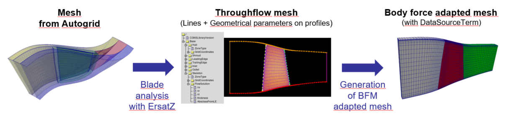

Workflow Compressor - Body force
================================
.. _cgnsview: https://cgns.github.io/CGNS_docs_current/cgnstools/cgnsview/index.html

.. _matplotlib: https://matplotlib.org/

The purpose of this tutorial is to show a simple example of a body force simulation
using the workflow Compressor.

.. important::
    Be sure to be comfortable with the :ref:`workflow Compressor<Workflow Compressor>` 
    before following this tutorial.

This tutorial follows the same example case that the tutorial :ref:`workflow Compressor<Workflow Compressor>`.
The directory of interest is *EXAMPLES/WORKFLOW_COMPRESSOR/rotor37_BodyForce*.

1. Preparation of the mesh
--------------------------

We start from a 3D mesh generated with Autogrid. The purpose of this section is to 
generate a mesh adapted for the body force method (BFM). There are two main operations:

#. Analyze the domain, and specifically the blade, with ErsatZ, in order to get the boundaries
   of the domain (hub, shroud, inlet, outlet), the leading edge and the trailing edge (projected in the X-R frame)
   and geometrical parameters of the blade (normal unit vector to the mean camber line, thickness and curvilinear abscissa from the leading edge).
   These data are gathered into a single CGNS file, called `BodyForceData_ROW.cgns`, where `ROW` is the name of the row family.

#. Generate the 3D mesh for BFM. This is done by transfinite interpolation between the boundaries of the 2D domain, 
   and then by making a revolution around the row axis. Geometrical data are also interpolated and stored in the node
   `FlowSolution#DataSourceTerm`.

The figure below illustrates this procedure:

      Meshing procedure to get a BFM adapted domain

In the user script, the mesh can be defined this way:

::code-block:: python

    CellWidthAtWall = 2e-6 
    CellWidthAtLE = 5e-6
    CellWidthAtInlet = 1e-3
    mesh = WF.prepareMesh4ElsA('r37.cgns', 
        BodyForceRows = dict(
            R37 = dict(
                NumberOfRadialPoints=81,
                NumberOfAxialPointsBeforeLE=41,
                NumberOfAxialPointsBetweenLEAndTE=41,
                NumberOfAxialPointsAfterTE=41,
                RadialDistribution=dict(kind='tanhTwoSides', FirstCellHeight=CellWidthAtWall, LastCellHeight=CellWidthAtWall),
                AxialDistributionBeforeLE=dict(kind='tanhTwoSides', FirstCellHeight=CellWidthAtInlet, LastCellHeight=CellWidthAtLE),
                AxialDistributionBetweenLEAndTE=dict(kind='tanhTwoSides', FirstCellHeight=CellWidthAtLE, LastCellHeight=CellWidthAtLE),
                AxialDistributionAfterTE=dict(kind='tanhTwoSides', FirstCellHeight=CellWidthAtLE, LastCellHeight=CellWidthAtInlet),
            )
        )
    )
    mesh = WF.parametrizeChannelHeight(mesh)
    C.convertPyTree2File(mesh, 'mesh.cgns')

The argument `BodyForceRows` triggers a remeshing adapted to body force modelling for each row listed in the dictionary.
For each row, all the parameters are optional, but it is recommended to give a full parametrization of the mesh
(otherwise, default values are got from the ersatZ anlysis of the blade). 

There is three zones for each row domain. If the row family is 'ROW', zone names are 
'ROW_upstream', 'ROW_bodyforce', 'ROW_downstream'. Body force will be applied only in 'ROW_bodyforce'.
This zone is fitted on the blade, that's why you need to correctly refine the mesh around joins between the zones
to discretize well gradients that will be used in BFM during the simulation.
In the zone 'ROW_bodyforce', the node `FlowSolution#DataSourceTerm` contains the geometrical parametrization of the blade.

If there are several rows in the input mesh, you are free for each row to generate a bodyforce adapted mesh
or to keep the initial mesh. If you transform the domains of two adjacent rows to make them adapted to BFM, 
there is no need for keeping a mixing plane at the interface between these rows. 

.. important:: Keep in mind that row domains with BFM are kept in the absolute frame of reference.

In this case, think about adding the additional argument `families2remove` to 
:mod:`~MOLA.WorkflowCompressor.prepareMesh4ElsA`:

:: code-block:: python

    mesh = WF.prepareMesh4ElsA('r37.cgns', 
        BodyForceRows = dict(
            R37 = dict(
                ...
            )
        ),
        families2remove = ['Rotor_stator_10_left', 'Rotor_stator_10_right']
    )

This will allow a matching join between rows.

2. Configure and launch computation
-----------------------------------

To activate BFM in the elsA simulation, just pass the argument `BodyForceInputData`
to :mod:`~MOLA.WorkflowCompressor.prepareMainCGNS4ElsA` or :mod:`~MOLA.WorkflowCompressor.launchIsoSpeedLines`.

This argument is a dictionary describing the body-force model (or the list of models) used 
for each row:

:: code-block:: python 

    BodyForceInputData = dict(
    R37 = dict(
        model='hall',
    )
)

The available models are:

* 'blockage': blockage term Sb.

* 'hall_without_blockage': Hall model (without the blockage term) with corrections by 
  Thollet: compressibility and viscous loss based on a analytical friction coefficient.
  The quadratic loss term based on the flow angle is not taken into account. 

* 'hall': a macro to give `['blockage', 'hall_without_blockage']`

* 'EndWallsProtection': a protection function near end walls. The distance defined in height percentage with 
  the additional parameter `ProtectedHeight` (by default 0.05).
  See :mod:`~MOLA.BodyForceTurbomachinery.computeBodyForce_EndWallsProtection`.

* 'constant': apply constant source terms, given with the additional argument `SourceTerms` 
  (dictionary with the keys `Density`, `MomentumX`, `MomentumY`, `MomentumZ`, `EnergyStagnationDensity`)

* 'ThrustSpread': spread a global force term (given with the additional parameter `Thrust`) on the
  volume of the body-force zone. 

3. Check the results and monitor the simulation
-----------------------------------------------

Compared with a case without body force, the file ``coprocess.log`` looks like that:

::

    [00]: iteration 628
    [00]: Update body force...
    [00]: iteration 629
    [00]: Update body force...
    [00]: iteration 630
    [00]: Update body force...
    [00]: will save OUTPUT/bodyforce.cgns ...
    [00]: ... saved OUTPUT/bodyforce.cgns
    [00]: will save OUTPUT/surfaces.cgns ...
    [00]: ... saved OUTPUT/surfaces.cgns
    [00]: will save OUTPUT/arrays.cgns ...
    [00]: ... saved OUTPUT/arrays.cgns
    [00]: iteration 631
    [00]: Update body force...
    [00]: iteration 632
    [00]: Update body force...

The update frequency of the body force can be controlled with the parameter `BodyForceComputeFrequency`.

The saving frequency of `bodyforce.cgns` can be controlled with the parameter `BodyForceSaveFrequency`. 

The initial iteration to apply body force can be controlled with the parameter 'BodyForceInitialIteration'.

This file `bodyforce.cgns` contains the source terms applied in the simulation (for each conservative variable).
However, its physical interpretation may be difficult. It is nonetheless mandatory to keep it 
to be able to restart the simulation.

Conclusion
----------

In this tutorial we have shown how to prepare and launch an elsA simulation of
compressor row using body-force.

Because BFM allows fast simulations, you may be interested in submitting several 
simulations at once to plot a iso-speed line. To do that, take a look at the 
:ref:`dedicated tutorial<_TutorialWorkflowCompressorMultipleJobs>`. 

As a user, please report bugs on the `GitLab of the projet <https://gitlab.onera.net/numerics/mola/-/issues?sort=created_date&state=opened>`_).
Alternatively, developers may be interested in exploring the sources in order to
improve or add body-force models.