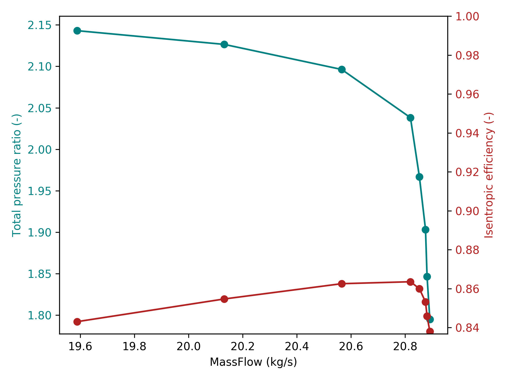

.. _TutorialWorkflowCompressorMultipleJobs:

Workflow Compressor - Multiple Jobs
===================================

.. _cgnsview: https://cgns.github.io/CGNS_docs_current/cgnstools/cgnsview/index.html

.. _matplotlib: https://matplotlib.org/

The purpose of this tutorial is to introduce the user to the submission of multiple
jobs with the workflow Compressor, including pre/co/post-processing.
This tool employs the functions implemented in module :mod:`MOLA.WorkflowCompressor`.

.. important::
    Be sure to be comfortable with the :ref:`workflow Compressor<Workflow Compressor>` for a single job
    before following this tutorial.

Firstly, take a look at section :ref:`Environment and machine` and check that
you are able to source the environment correctly. Also read section
:ref:`Autologin to SATOR machine` to fill the requirements for this tutorial.

This tutorial follows the same example case that the tutorial :ref:`workflow Compressor<_TutorialWorkflowCompressor>`.
The directory of interest is *EXAMPLES/WORKFLOW_COMPRESSOR/rotor37_IsoSpeedLine*.

Prepare the simulations
-----------------------

In this tutorial, we will prepare the simulation either on eos or spiro, and
jobs will be submitted on sator at the specified path.

It is assumed to have already a suited mesh, processed with
:mod:`~MOLA.WorkflowCompressor.prepareMesh4ElsA`. If not, see the previous
tutorial :ref:`workflow Compressor<Workflow Compressor>`.

The preparation of a case is very similar to what was done for a single case in
the previous tutorial on the :ref:`workflow Compressor<Workflow Compressor>`.
The same structure as the file can be taken, except that we won't apply the
function :mod:`~MOLA.WorkflowCompressor.prepareMainCGNS4ElsA`. Instead, we have
to define some additional parameters and apply
:mod:`~MOLA.WorkflowCompressor.launchIsoSpeedLines`.

Here there is the last lines of the example file
:download:`launchIsoSpeedLines.py <../../EXAMPLES/WORKFLOW_COMPRESSOR/rotor37_IsoSpeedLine/launchIsoSpeedLines.py>`:

.. literalinclude:: ../../EXAMPLES/WORKFLOW_COMPRESSOR/rotor37_IsoSpeedLine/launchIsoSpeedLines.py
    :language: python
    :lines: 123-

.. important::
    The intermediate ``mesh.cgns`` file must be saved before calling the function
    :mod:`~MOLA.WorkflowCompressor.launchIsoSpeedLines`.

First, we may notice that :mod:`~MOLA.WorkflowCompressor.launchIsoSpeedLines` has
the same argments than :mod:`~MOLA.WorkflowCompressor.prepareMainCGNS4ElsA`,
plus some others that are defined just above the function.

.. note::
    ``JobInformation`` is not optional in this function. Notice that the value
    ``NumberOfProcessors`` is the number of processors per job (one for each
    iso-speed line).

The arguments that are common with :mod:`~MOLA.WorkflowCompressor.prepareMainCGNS4ElsA`
are the **default set of parameters** for **THIS** submission of jobs.

Other arguments are the following:

* **machine** is the name of the machine on which we want to run.

* **DIRECTORY_WORK** establishes the SATOR location where the cases
  will be launched. If the indicated directory does not exist, then it will be
  automatically created.

* **ThrottleRange** is the list of values used to change the operating point on
  the iso-speed line. These values will be used to modify the default ones in
  the **BoundaryConditions** :py:class:`list`.

  The expected values depend on the valve law defined in the
  **BoundaryConditions**:

  * for valve law 0, the modified parameter is ``prespiv``

  * for valve laws 1 and 5, the modified parameter is ``valve_ref_pres``

  * for valve laws 2, the modified parameter is ``valve_ref_mflow``

  * for valve laws 3 and 4, the modified parameter is ``valve_relax``

  .. note:: to learn more about valve laws, see the
    `dedicated elsA Tutorial <http://elsa.onera.fr/restricted/MU_MT_tuto/latest/STB-97020/Textes/Boundary/Valve.html>`_

  Thus, in the example given above, because the valve law is the fourth, the
  **ThrottleRange** is equal to:

  >>> ThrottleRange = [van*ReferenceValues['PressureStagnation'] for van in [0.2, 0.4, 0.6, 0.8, 1.0, 1.2]]

  .. danger::
    Currently, simulations are launched by **increasing order** of throttle value,
    but not in the order of the list **ThrottleRange**.

* **RotationSpeedRange** is a list of rotation speed. It is useful to compute
  several iso-speed lines in parallel. One job per rotation speed will be
  launched, and iso-speed lines are computed completely independently.

When we are ready to submit this bunch of simulations, we just have to execute
the command :

>>> python launchIsoSpeedLines.py

The displayed message should be similar to this one:

.. code-block:: bash

    Assembling run 0 Throttle=20266.0 RotationSpeed=-1800.0 | NewJob = True
    Assembling run 1 Throttle=25332.5 RotationSpeed=-1800.0 | NewJob = False
    Assembling run 2 Throttle=30399.0 RotationSpeed=-1800.0 | NewJob = False
    Assembling run 3 Throttle=35465.5 RotationSpeed=-1800.0 | NewJob = False
    Assembling run 4 Throttle=40532.0 RotationSpeed=-1800.0 | NewJob = False
    Assembling run 5 Throttle=45598.49999999999 RotationSpeed=-1800.0 | NewJob = False
    Assembling run 6 Throttle=50664.99999999999 RotationSpeed=-1800.0 | NewJob = False
    Assembling run 7 Throttle=55731.49999999999 RotationSpeed=-1800.0 | NewJob = False
    Assembling run 8 Throttle=60797.999999999985 RotationSpeed=-1800.0 | NewJob = False
    Assembling run 9 Throttle=65864.49999999999 RotationSpeed=-1800.0 | NewJob = False

    written file JobsConfiguration.py

    /tmp_user/sator/tbontemp/rafale_rotor37/
    Assuming SLURM job manager
    ssh tbontemp@sator "cd /tmp_user/sator/tbontemp/rafale_rotor37/DISPATCHER; sbatch dispatcherJob.sh"
    Submitted batch job 46679

    sbatch: Soumission depuis noeud de connexion EL8, routage partition all-el8

    submitted DISPATCHER files and launched dispatcher job

.. note::
    It is possible to use different mesh files for each rotation speed. To do
    that, simply use a :py:class:`list` of :py:class:`str` instead of a
    :py:class:`str` for the **mesh** argument of
    :mod:`~MOLA.WorkflowCompressor.launchIsoSpeedLines`. Be careful, the length
    of this list must be the same that the list **RotationSpeedRange** !

Monitor jobs
------------

Staying in the submission directory on eos, spiro or visung, we can download
:download:`JobsMonitor.py <../../TEMPLATES/WORKFLOW_COMPRESSOR/JobsMonitor.py>`.
It contains the following lines:

.. literalinclude:: ../../TEMPLATES/WORKFLOW_COMPRESSOR/JobsMonitor.py
    :language: python

We have only to modify the path **DIRECTORY_WORK** if needed, and execute this script with
python.
The output should be like:

.. code-block::

    Reading arrays.cgns (bin_hdf)...done.
    Reading arrays.cgns (bin_hdf)...done.
    Reading arrays.cgns (bin_hdf)...done.
    Reading arrays.cgns (bin_hdf)...done.
    Reading arrays.cgns (bin_hdf)...done.
    Reading arrays.cgns (bin_hdf)...done.
    Reading arrays.cgns (bin_hdf)...done.

          JobName |    rotor370
    RotationSpeed |     -1800
                  |                      MFR             RPI             ETA
         Throttle |________________________________________________________________
            20266 |       OK           20.8784         1.81081         0.836534
          25332.5 |       OK           20.8744         1.85966         0.844838
            30399 |       OK           20.8509          1.9196         0.853484
          35465.5 |       OK           20.8278          1.9834         0.859926
            40532 |       OK            20.785          2.0468         0.864265
          45598.5 |       OK           20.5382          2.0948         0.861596
            50665 |       OK           20.1106         2.12519         0.852768
          55731.5 |       GO
            60798 |       PD
          65864.5 |       PD

It gives the status of simulations and an overview of performance of the
monitored row (inlet massflow, total pressure ratio and isentropic efficiency)
for completed simulations, and plot the following figure:

   Example of performance on the iso-speed line

.. _Conclusion-TutorialWorkflowCompressorMultipleJobs:

Conclusion
----------

In this tutorial we have shown how to prepare and launch multiple elsA
simulations at once for fan or compressor stage(s).
