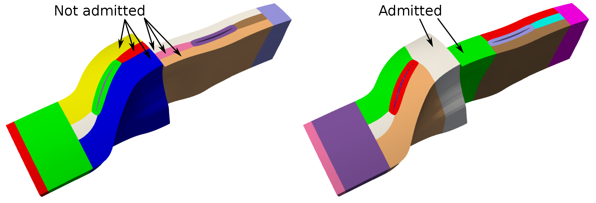
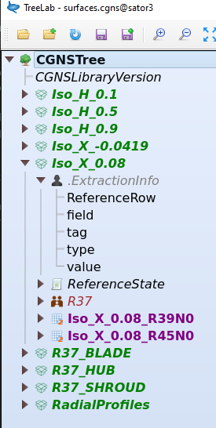
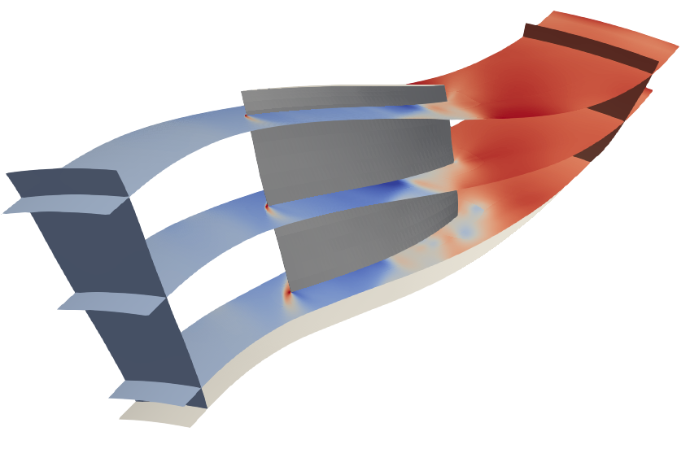
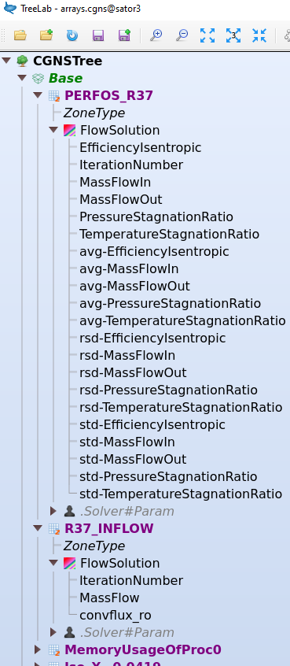

########
Rotor 37
########

:fas:`person-digging;sd-text-warning` Work in progress :fas:`person-digging;sd-text-warning`

.. py:currentmodule::  mola.workflow.rotating_component.turbomachinery

The purpose of this tutorial is to introduce the user to the *WorkflowTurbomachinery* allowing
for making CFD computations of the flow around one or several compressor rows. This tool employs
the functions implemented in module :mod:`mola.workflow.rotating_component.turbomachinery.workflow`.

.. This tutorial follows the example case in: `/stck/mola/data/mesh/rotor37/rotor37.cgns`

It develops the preparation of the mesh, starting from a file generated with
Autogrid 5, the preparation of the simulation with elsA,
the monitoring of results, and how the simulation comes to an end.

You may also find a FAQ section at the end of the tutorial, to be able to go
beyond the simple case presented here.

Inputs are:

#. a mesh generated by Autogrid 5: `/stck/mola/data/mesh/rotor37/rotor37.cgns`

#. the script :download:`prepare.py <snippets/prepare.py>`

1. Preparation of the mesh
--------------------------

The purpose of this section is to prepare the mesh that will be used for one or
several elsA simulations. The following operations will be done:

#. load and clean the mesh from Autogrid 5
#. apply transformations
#. add grid connectivities
#. duplicate the mesh in rotation (if needed)
#. split and distribute the mesh (only if PyPart is not used)
#. make final elsA-specific adaptations of CGNS data
#. add the height coordinate (0 at hub, 1 at shroud) at mesh nodes

Input mesh
**********

First of all, we need to check that our input mesh fills the following
requirements:

#. It has to have been generated by Autogrid 5 (tested on version 12.2 only).
   In particular, the engine axis is supposed to be the Z-axis, and the lengths
   are in meters.

#. Families corresponding to each row must be written in the CGNS file.

#. Boundary conditions must be written in the CGNS and associated with Families.
   That includes rotor/stator interfaces.

   .. important::
        Because wall boundary conditions will be automatically set latter, the
        names of associated families must be the following:

        * for the shroud: all family names must contain the pattern 'SHROUD' or 'CARTER'
          (in lower, upper or capitalized case)

        * for the hub: all family names must contain the pattern 'HUB' or 'MOYEU'
          (in lower, upper or capitalized case)

        * for the blades: all family names must contain the pattern 'BLADE' or 'AUBE'
          (in lower, upper or capitalized case).

   An example of such a mesh is given in the figure below:

   .. figure:: img/inputMeshAG5_tree.png
      :width: 90%
      :align: center

      Example of input mesh tree

.. note::
    The mesh does not need to contain grid connectivities, but their presence
    is not a problem.

.. note::
    To have families (for boundary conditions and rotor/stator interfaces) in the
    CGNS file written by Autogrid, be sure to have checked the option
    "Save CGNS patch info / family name control" in the pannel "Saving" of Preferences.

    .. figure:: img/AG5_preferences.png
       :width: 40%
       :align: center

       Recommended saving preferences in Autogrid5

Without PyPart
~~~~~~~~~~~~~~

In this case, there is an additional constraint on the input mesh.
Each future globborder must be in contact with a unique block. The figure
below illustrates this requirement:

  Examples of not admitted and admitted meshes

This is required to be sure that the splitting will produce a matricial
blocking (needed for globborders).

2. Configure and launch computation
-----------------------------------

The script :download:`prepare.py <snippets/prepare.py>`
continues with the following lines:

.. literalinclude:: snippets/prepare.py
    :language: python

In a nutshell, we just need to define several dictionaries and lists with user-defined
parameters (them that differ from the default parameters of the workflow).

Dictionaries and lists with user-defined parameters are explained in details in comments in
the scripts.
However, we can sum up their purpose here:

* **RawMeshComponents** ((:py:class:`list`)): contains information about the mesh (or meshes)
  and the operations to perform on it (translation, rotation, connectivities generation, etc.).

* **ApplicationContext** (:py:class:`dict`): contains all the parameters specific to the geometry,
  rows names and rotation speeds, reference planes, etc.

* **Flow** (:py:class:`dict`): contains values used to compute the reference flow field, that can
  be also used by as default values for some boundary conditions.

* **Turbulence** (:py:class:`dict`): contains values used to set initial turbulent field and define
  turbulent modelling.

* **Numerics** (:py:class:`dict`): contains the parameters such as the NumberOfIterations, CFL, 
  spatial scheme, time marching strategy, etc.

* **BoundaryConditions** (:py:class:`list`): contains all the boundary conditions
  to impose, except them on the walls (these ones are defined automatically).

* **Initialization** (:py:class:`dict`): contains parameters to initialize the
  flow field.

* **Extractions** (:py:class:`list`): contains all the extractions (3D, 2D, 1D) to
  perform in coprocessing. Each extraction is defined as a :py:class:`dict` with a minimalist
  number of keys.

* **RunManagement** (:py:class:`dict`): contains information such as the job name, the AER number
  and the number of processors.

All the preprocess is done using the method `prepare()` of the Workflow.

After that, the method `write_cfd_files()` creates the following files:

Then, we can launch the simulation in two different ways:

#. Using the method `submit()` of the workflow

#. Going to the right directory on the right machine, and submit manually the job.
   For instance, on a machine using the job handler SLURM, you may use `sbatch job.sh`.

3. Check the results and monitor the simulation
-----------------------------------------------

During the simulation, the file :mola_name:`FILE_COLOG` is written progressively. It
contains only the iterations and the save of extrations. As a reminder,
extraction options are given by the :py:class:`list` **Extractions**.

The corresponding files are saved in the directory :mola_name:`DIRECTORY_OUTPUT`, which is 
automatically created at the begining of the simulation. Extraction data are updated each
`ExtractPeriod` iterations, and are saved periodically according the values of `SavePeriod`.
We can also trigger a manual extraction with the commands:

::

    >>> touch SAVE_FIELDS  # shortcut for all 3D extractions
    >>> touch SAVE_SURFACES  # shortcut for all 2D extractions
    >>> touch SAVE_SIGNALS  # shortcut for all 1D extractions
    >>> touch SAVE_BC  # shortcut for all extractions with Type='BC'
    >>> touch SAVE_signals.cgns  # write extractions related to file signals.cgns

We can check that the signal is well written in the file :mola_name:`FILE_COLOG`:

::

    [0]: iteration 40
    [0]: iteration 41
    [0]: Received signal SAVE_SURFACES
    [0]: iteration 42
    [0]: will save OUTPUT/extractions.cgns ...
    [0]: ... saved OUTPUT/extractions.cgns
    [0]: iteration 43
    [0]: iteration 44

3D extractions: :mola_name:`FILE_OUTPUT_3D`
*******************************************

By default, extractions of 3D fields will be at nodes.

2D extractions: :mola_name:`FILE_OUTPUT_2D`
*******************************************

As explained before, there are a lot of available 2D extractions that can be
defined. Each extracted surface is written in one base of the PyTree saved (by default) in
:mola_name:`FILE_OUTPUT_2D`:

    Content of the file :mola_name:`FILE_OUTPUT_2D`

In the figure above, the base *Iso_CoordinateX_0.08* has been unwrapped. We see
that it contains:

* one zone (``R37_R37_downstream.P0.N0.2``, which has been renamed by PyPart).
  Because it has been got with Cassiopee :func:`Post.isoSurfMC` method, it is
  unstructured. It still has a node ``FamilyName`` = ``R37``.

* the ``Family_t`` node ``R37``. It has been added because of the presence of a
  zone tagged with this family. It contains the node ``.Solver#Motion`` with
  motion information about the family.

* the node ``ReferenceState``, identical to the one found in :mola_name:`FILE_INPUT_SOLVER`.

* a node :mola_name:`CGNS_NODE_EXTRACTION_LOG`, which is optional and have been created
  automatically with information in the :py:class:`list` **Extractions**. It contains the following nodes:

  * *Type* = ``IsoSurface``: indicates the type of extraction.

  * *IsoSurfaceField* = ``CoordinateX``: indicates the variable used for the isosurface.

  * *IsoSurfaceValue* = ``0.08``: indicates the value used for the isosurface.

  * *ReferenceRow* = ``R37``: indicates that this surface is in the domain of the
    row ``R37``.

  * *tag* = ``InletPlane``: indicates a specific attribute for the extracted surface.

  *Type*, *IsoSurfaceField* and *IsoSurfaceValue* have been automatically added during the extraction.
  It allows not to depend on the name of the base, and are enough to defined
  completely the surface. 

.. hint::
    Arbitrary information nodes can be added by the user by defining them in
    the :py:class:`list` **Extractions**.

    Visualization the file :mola_name:`FILE_OUTPUT_2D` with Paraview

1D extractions: :mola_name:`FILE_OUTPUT_1D`
*******************************************

The file :mola_name:`FILE_OUTPUT_1D` may contain different kinds of data:

* Memory usage (mainly for debug)

Each data group is written in one base of the PyTree saved in :mola_name:`FILE_OUTPUT_1D`:

    Content of the file :mola_name:`FILE_OUTPUT_1D`

.. We can monitor the contains of :mola_name:`FILE_OUTPUT_1D` during the simulation with the
.. script :download:`monitor_perfos.py <../../TEMPLATES/WORKFLOW_COMPRESSOR/monitor_perfos.py>`.
.. Except if we want to change the display of figures, we can launch it as is in
.. the simulation folder:

.. code-block::

    >>> python monitor_perfo.py

.. note::
    This script was written to be generic. It should be applied without any
    change to any case run using MOLA. If not, please report this case and this
    script will be adapted in its next version.

It results in the creation of several figures:

* the first set of figures allows to monitor the performance of each row (one
  figure per row). Each figure is displayed and also saved as ``perfos_<ROW>.png``:

  .. figure:: img/perfos_R37.png
      :width: 100%
      :align: center

      Performance of the row R37, read from the file :mola_name:`FILE_OUTPUT_1D`. On the left,
      raw data and sliding average. On the right, relative standard deviation
      (= standard deviation divided by average).

* the figure ``massflow.png``, showing massflow rates through several planes:

  * the boundary conditions ``R37_INFLOW`` and ``R37_OUTFLOW`` are automatically
    included on this figure because they are recognized with their types
    ``BCInflow*`` and ``BCOutflow*``. Notice that for another case, rotor/stator
    interfaces would also be integrated to the figure, because they are also
    identified as ``BCInflow*`` and ``BCOutflow*`` by MOLA preprocess.

  * the planes identified as ``PERFOS_R37_In`` and ``PERFOS_R37_Out``, corresponding
    to the *InletPlane* and *OutletPlane* for the row *R37*.

  .. figure:: ../../EXAMPLES/WORKFLOW_COMPRESSOR/rotor37_SingleCase/massflow.png
      :width: 60%
      :align: center

      Massflow

* the figure ``residuals.png``:

  .. figure:: ../../EXAMPLES/WORKFLOW_COMPRESSOR/rotor37_SingleCase/residuals.png
      :width: 60%
      :align: center

      Residuals

  .. note::
    This figure is generated only if the simulation is over. This mechanism
    should be improved in the future to be able to monitor residuals during the
    simulation.

.. hint::
    If we want to save one file for each iteration of extraction (for example for
    an unsteady simulation), we just need to add the argument
    ``tagWithIteration`` = :py:obj:`True` to :mod:`~MOLA.Coprocess.save` in
    ``coprocess.py``:

        >>> CO.save(arraysTree, os.path.join(DIRECTORY_OUTPUT,FILE_ARRAYS), tagWithIteration=True)

    This stands for 3D (:mola_name:`FILE_OUTPUT_3D`), 2D (:mola_name:`FILE_OUTPUT_2D`) and 1D
    (:mola_name:`FILE_OUTPUT_1D`) extractions, because the same function :mod:`~MOLA.Coprocess.save`
    is used in the three cases.

4. End of the simulation
------------------------

The simulation may end for several reasons:

#. the simulation has reached the maximum iteration. This situation should be
   avoided by setting a really high value (default is 30000).
   The empty file :mola_name:`FILE_JOB_COMPLETED` is created to tag the simulation directory.

#. the Time Out has been reached (set by default to 15h for sator). In that case,
   because there is a security margin, final extractions are done and the
   simulation is ended normally.
   The empty file :mola_name:`FILE_NEWJOB_REQUIRED` is created to tag the simulation directory.

#. The convergence criterion has been reached. It must have been programmed in
   the :py:class:`list` **ConvergenceCriteria**.

    The empty file :mola_name:`FILE_JOB_COMPLETED` is created to tag the simulation directory.

#. the signal `STOP` has been sent by user (with the command `touch`).
   It is useful if we 'see' by monitoring the simulation that it has converged
   enough for our purpose. Final extractions are done and the simulation is
   ended normally.
   The empty file :mola_name:`FILE_JOB_COMPLETED` is created to tag the simulation directory.

#. the signal `QUIT` has been sent by user (with the command ``touch``). In that
   case, the simulation is ended abruptly without safe savings. This signal
   should not be used except in emergency.

If no error was encountered, :mola_name:`FILE_INPUT_SOLVER` is automatically updated with a new
value for the initial iteration and for initial fields. 
A new simulation may be launch by just submitting again the job file.

Besides, if the simulation ended normally, all the log files are moved inside the
:mola_name:`DIRECTORY_LOG` directory.

5. FAQ - To go further
----------------------

How to use MOLA with a mesh with different properties than expected ?
*********************************************************************

Check the optional arguments of :mod:`MOLA.WorkflowCompressor.prepareMesh4ElsA`.
In particular, arguments **scale** and **rotation** allow applying user-defined
transformations.
For example, **scale** = 0.001 to transform a mesh that was in millimeters in Autogrid.

.. important::
    You may use MOLA without any difference with a structured mesh or an
    unstructured mesh. The type of mesh will be automatically detected. If needed,
    you may also use the following command to make a structured mesh unstructured:

    .. code-block:: python

        import WorkflowCompressor as WF
        t = WF.convert2Unstructured(t)

    This command also merges zones if possible, resulting in a mesh with one zone
    per bladed row. It seems to be a good practice to let PyPart split the mesh
    in the optimal way.

How to know default parameters of the workflow ?
************************************************

The easiest way is to run :mod:`~MOLA.WorkflowCompressor.prepareMainCGNS4ElsA`
once. The resulting file ``setup.py`` contains all the parameters set by MOLA,
either user-provided parameters and default ones.

How to change the turbulence model ?
************************************

Simply modify (or add) the parameter ``TurbulenceModel`` in the :py:class:`dict`
**ReferenceValues**. It will tune all the keys needed in the ``model`` object of
*elsA* to fit to the reference turbulence model definition. Check the
documentation of :mod:`MOLA.Preprocess.computeReferenceValues`
for further information on the available models and to get the
references.

How to change numerical parameters ?
************************************

Simply add wished parameters in the :py:class:`dict` **NumericalParams**.
All the given parameters will be passed as it to ``numerics`` object of *elsA*
(e.g. you may add ``psiroe`` = 0.02), except the following macro parameters for
MOLA:

* ``NumericalScheme``: one of ``jameson``, ``ausm+``, ``roe``

* ``TimeMarching``: one of ``steady``, ``gear``, ``DualTimeStep``

Changing these parameters modifies other related parameters (for example,
artificial viscosity parameters depend on the numerical scheme). If needed, you
can set custom values for these default related parameters anyway.

How to change any *elsA* parameter ?
************************************

Any elsA key in the *elsA* objects ``cfdpb``, ``model`` and ``numerics`` may be overwritten by passing the optional 
argument ``OverrideSolverKeys`` to the function :mod:`~MOLA.WorkflowCompressor.prepareMainCGNS4ElsA`:

.. code-block:: python

    # Override keys
    OverrideSolverKeys = dict(
        cfdpb    = dict(),
        model    = dict(),
        numerics = dict()
    )

For instance, to use a different algorithm to compute the distance to the walls, you can use: 

.. code-block:: python

    WF.prepareMainCGNS4ElsA(
      ..., 
      OverrideSolverKeys=dict(cfdpb=dict(walldistcompute='gridline'))
      )

How to duplicate the mesh ?
***************************

There are two ways to duplicate the mesh: during mesh preparation or
after flow initialization.

Duplication during mesh preparation (not recommended)
~~~~~~~~~~~~~~~~~~~~~~~~~~~~~~~~~~~~~~~~~~~~~~~~~~~~~

You might add the optional argument **duplicationInfos** (of type :py:class:`dict`)
to function :mod:`~MOLA.WorkflowCompressor.prepareMesh4ElsA`.

For instance, see the following example:

  .. code-block:: python

      duplicationInfos = dict(
          row_2 = dict(
              NumberOfBlades = 36,
              NumberOfDuplications = 12,
              MergeBlocks = False
          )
        )

The row named *row_2* has 36 blades. The meshed domain attached to the
``Family`` *row_2* is duplicated to have 12 repetitions. Here **MergeBlocks**
is here equal to :py:obj:`False` (default value). If it was :py:obj:`True`, it
would mean that zones and BCs are merged after the duplication if possible.
It might be useful in some specific cases.

Duplication after flow initialization (recommended)
~~~~~~~~~~~~~~~~~~~~~~~~~~~~~~~~~~~~~~~~~~~~~~~~~~~

This is probably the best choice if it allows you to get the desired result.
During the call to :mod:`~MOLA.WorkflowCompressor.prepareMainCGNS4ElsA`, flow
solution is initialized with the chosen method on the initial mesh, and then
the mesh is duplicated (rotating vectors of the flow solution accordingly).
It has several advantages compared with the other method:

* the file ``mesh.cgns`` is much smaller.

* the computation of the variable ``ChannelHeight`` and the initialization are
  made on this smaller mesh.

* It allows to initialize an unsteady case on several blade channels from a
  single channel steady case. To do that, use the method 'copy' in the
  **Initialization** :py:class:`dict`, and the key *file* indicating the path
  to the file :mola_name:`FILE_OUTPUT_3D` used for the initialization.

.. important::
    Boundary conditions are set after the duplication. Be careful of setting
    related parameters accordingly (massflow on the right surface for instance).

.. note::
    Vectors in ``BCDataSet_t`` nodes are **not rotated**. However, because boundary
    conditions are set after the duplication, there should not be nodes with
    that type.

To indicate the number of blades that you want in each row, simply update the
key **NumberOfBladesSimulated** in the :py:class:`dict` **TurboConfiguration**.
When you execute the function :mod:`~MOLA.WorkflowCompressor.prepareMainCGNS4ElsA`,
you have also to check in the display that the number of blades in the initial
mesh for each row is correctly detected. If not, you can indicate it manually
with the key **NumberOfBladesInInitialMesh**.

However, this method does not suit if, for instance, you want to initialize a
360 degrees case from another one. In that case, you should duplicate the mesh
with :mod:`~MOLA.WorkflowCompressor.prepareMesh4ElsA`. Then,
**NumberOfBladesSimulated** will be equal to **NumberOfBladesInInitialMesh** so
the mesh will remain unchanged by :mod:`~MOLA.WorkflowCompressor.prepareMainCGNS4ElsA`.
If you do not perform the duplication during mesh preparation, the initialization
will be done on one blade channel only, and then duplicated periodically.

Conclusion
----------

In this tutorial we have shown how to prepare and launch an elsA simulation of
fan or compressor stage(s).

.. attention:: the suitability of this workflow to other applications or usages
    beyond the scope of its design purposes is not guaranteed.

Users willing to modify default parameters in order to make an advanced use of
this workflow (such as turbulence modeling or other specific physical or
numerical settings) are invited to consult the documentation of dedicated
functions in :mod:`MOLA.WorkflowCompressor` in order to verify if it can meet
its requirements.

As a next step, users may be interested in the following tutorial on the launch
of several jobs at once to describe an iso-speed line or to make a parametric
study.

Alternatively, developers may be interested in exploring the sources in order to
improve the workflow, or even creating a new workflow more adapted to specific
needs.
