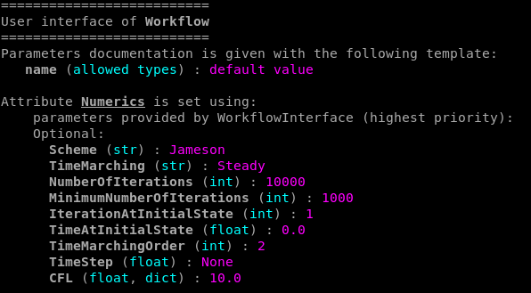
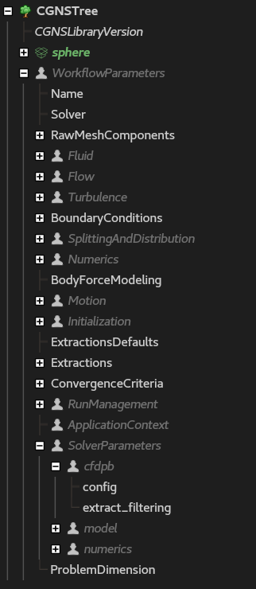

#################################################
A general introduction to the concept of Workflow
#################################################

.. py:currentmodule::  mola.workflow.workflow

.. toctree::
    :maxdepth: 1
    :hidden:

    airfoil
    linear_cascade
    rotating_component
    turbomachinery
    manager

********************
What is a Workflow ?
********************

As a user, your main interface with mola will be an object called Workflow. 
It handles all stages from mesh, preprocess, run with coprocess, postprocess and visualization.

In a nutshell, a Workflow is used like this:

.. code-block:: python
    
    from mola.workflow import Workflow  # choose a suitable Workflow for your application

    workflow = Workflow(...)  # user parameters don't change with the solver
    workflow.prepare()
    workflow.write_cfd_files()
    workflow.submit()

First you may :ref:`choose a suitable Workflow for your application.<Which Workflow to choose ?>`

Then, you must :ref:`provide inputs to the Workflow.<What are the inputs of a Workflow ?>`

Finally, you can use the methods :meth:`Workflow.prepare`, :meth:`Workflow.write_cfd_files` 
and :meth:`Workflow.submit` to :ref:`run your simulation.<How to run my simulation ?>`

.. warning:: 

    Have you already chosen a solver and sourced mola environment ? 
    If not, see :ref:`how to source the right environment.<Environment>`

**************************
Which Workflow to choose ?
**************************

Workflows are stored in `mola.workflow`. The most general Workflow is imported with the line:

.. code-block:: python

    from mola.workflow import Workflow
    workflow = Workflow(...)

However, this Workflow **should not be used** in general, because it only define the common 
structure and methods for all other Workflows, but defining a minimal set of default parameters.

Instead, prefer to use a Workflow that corresponds to your application case. It will provide
adapted default parameters and specific methods (for pre, co and postprocess) that will enhance
your experience by facilitating the data configuration.

Currently, available applicative workflows are:

.. grid:: 3

    .. grid-item-card::
        :img-top: ../../examples/img/thumb_r37.png
        :link: airfoil.html

        **airfoil**
        ^^^
        for 2D airfoil simulation, useful to compute polars

    .. grid-item-card::
        :img-top: ../../examples/img/thumb_r37.png
        :link: linear_cascade.html

        **linear_cascade**
        ^^^
        for configurations with a periodicity by translation

    .. grid-item-card::
        :img-top: ../../examples/img/thumb_r37.png
        :link: turbomachinery.html

        **turbomachinery**
        ^^^
        for fan, compressor and turbine applications

Once you have imported the right module, you may instanciate a Workflow with the command:

.. code-block:: python

    from mola.workflow import airfoil
    workflow = airfoil.Workflow(...)  # same with all the workflow modules

The following sections are common for all workflows.

***********************************
What are the inputs of a Workflow ?
***********************************

Let's detail what arguments are into the parentheses `Workflow(...)`.

List of attributes of Workflow:
Solver,
RawMeshComponents,
Fluid,
Flow,
Turbulence,
BoundaryConditions,
SplittingAndDistribution,
Numerics,
BodyForceModeling, 
Motion, 
Initialization, 
ExtractionsDefaults,
Extractions, 
ConvergenceCriteria, 
RunManagement, 
ApplicationContext, 
SolverParameters 

The method `Workflow.print_interface()` allows printing what names and
types of arguments are expected when the Workflow is instanciated.
`Workflow.print_interface()` prints all possible arguments. 
`Workflow.print_interface('Numerics')` prints only the interface for the 
given argument (here 'Numerics' for instance).

    
    Output of workflow.print_interface('Numerics')

.. dropdown:: Example of output of workflow.print_interface()
    :color: info

    .. literalinclude:: snippets/print_interface_output.txt

.. with extension sphinxcontrib.ansi, it is possible to define an ansi-block with colors in text

If name or type of an expected argument is wrong, an error will be raised by MOLA immediately.

.. dropdown:: Example of user error in workflow interface
    :color: danger

    The following error is raised because the user forgot the final 's' at `NumberOfIterations` in `Numerics`.

    .. figure:: img/error_interface_Numerics.png
        :align: center

**************************
How to run my simulation ?
**************************

Once the workflow has been well created, it is time to proceed to 
data preprocessing and run the simulation.

.. code-block:: python
    
    workflow.prepare()
    workflow.write_cfd_files()
    workflow.submit()

==================
workflow.prepare()
==================

Method :meth:`Workflow.prepare` performs the entire preprocess, from the mesh 
to data ready for the simulation run.

For the base Workflow, it runs all stages below:

.. literalinclude:: ../../../../src/mola/workflow/workflow.py
    :language: python
    :pyobject: Workflow.prepare

.. caution::

    For applicative workflows, that derive (inherit) from the base Workflow,
    the method `prepare()` still exists, but methods inside may be modified to 
    perform new operations. 

==========================
workflow.write_cfd_files()
==========================

Method :meth:`Workflow.write_cfd_files` saves data on the disk, at the right path 
given by `RunManagement['RunDirectory']` (or the local path by default). It may also 
be a path on a distant machine, given by `RunManagement['Machine']`.

.. hint::

    On ONERA environment, paths `/tmp_user/sator/*` and `/tmp_user/juno/*` are automatically
    detected as sator and juno paths respectively.

Files needed for the simulation depend on the chosen solver. However, the following files are
common to elsA, SoNICS and Fast:

* :mola_name:`FILE_JOB`: the job file to submit, for instance with `sbatch` command 
  if the cluster handles jobs with SLURM.
* :mola_name:`FILE_INPUT_SOLVER`: Solver input data file
* :mola_name:`FILE_COMPUTE`: Solver input script

=================
workflow.submit()
=================

Method :meth:`Workflow.submit` submits the job where it should be, depending on parameters
in `RunManagement`. If `RunManagement['Machine']` is a machine with jobs handled with SLURM, 
it is equivalent to connect to this machine with ssh, move to the run directory
`RunManagement['RunDirectory']`, and run the command `sbatch job.sh`. 

.. tip::

    If needed, the command can be modified with parameter `RunManagement['LauncherCommand']`.

***********************
What's in my Workflow ?
***********************

When the workflow is written in a :mola_name:`FILE_INPUT_SOLVER` file, all its attributes are stored 
in the first level node `WorkflowParameters`: 

It is also possible to print all the attributes of a Workflow in a Python script
simply using the function `print(workflow)` or the method `workflow.print()`.

.. dropdown:: Example of output of print(workflow)
    :color: info

    .. literalinclude:: snippets/print_workflow.txt

.. tip::

    Looking in `WorkflowParameters` in :mola_name:`FILE_INPUT_SOLVER` file is a good way 
    to know which default parameters were applied by MOLA.

**********************
What are run outputs ?
**********************

In MOLA, outputs do not depend on the chosen solver, but only on what was asked 
by user in Workflow inputs.

First of all, the main.cgns is automatically updated at the end of the run to allow 
re-submiting the computation as it.

Then, all outputs are stored in the :mola_name:`DIRECTORY_OUTPUT` directory.

************************
Read a previous Workflow
************************

MOLA provides a function to read a Workflow previously written in a CGNS file, 
selecting automatically the right class to instanciate this Workflow. 

.. code-block:: python

    from mola.workflow import read_workflow

    workflow = read_workflow('main.cgns')

*********************
Submit multiple cases
*********************

To launch several cases at once, you may use the `WorkflowManager`:

.. literalinclude:: snippets/manager.py
    :language: python

More documentation is available in the section :ref:`WorkflowManager`.

***********************
Miscellaneous
***********************

.. todo:: 
    
    - write_tree / write_tree_remote, then mola_prepare
    - preprocess MPI
    - merge workflows
